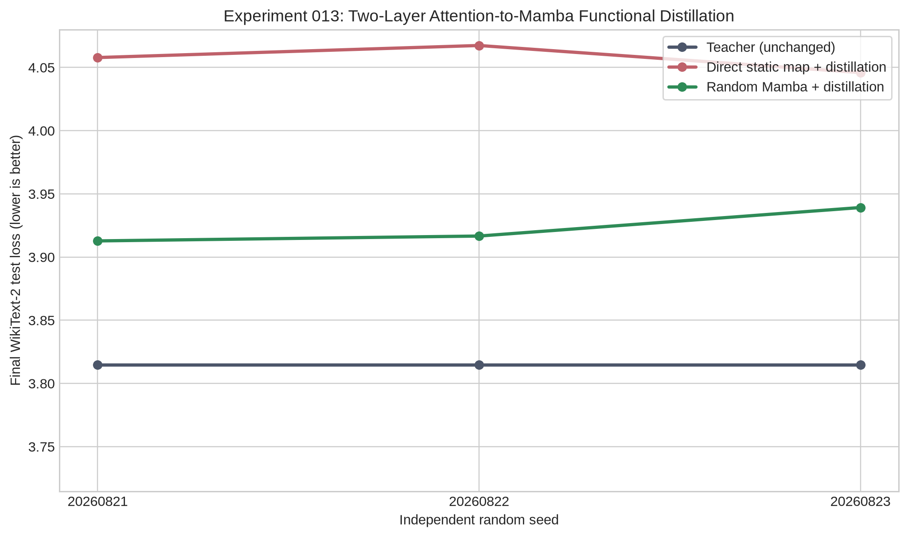

# Experiment 013: Independent-Seed Replication of Two-Layer Attention-to-Mamba Functional Distillation

**Author:** Manus AI  
**Status:** Completed  
**Decision:** Do **not** replace a third attention layer yet. Improve held-out generalization and add a no-teacher control before scaling.

## Executive Summary

This experiment replicated the two-layer **SmolLM-135M attention-to-Mamba hybrid** across three independent Mamba-initialization seeds. It used the pretrained `HuggingFaceTB/SmolLM-135M` checkpoint as the fixed Transformer-family teacher and replaced attention layers 0 and 1 with Mamba selective state-space mixer branches. SmolLM-135M is a 135M-parameter base language model released by Hugging Face [1]. Mamba is a selective state-space architecture designed as an alternative sequence-modeling backbone to attention [2].

The test split of WikiText-2 was kept untouched until the final evaluation. WikiText provides explicit train, validation, and test partitions, and its raw WikiText-2 subset retains natural text rather than an artificially constructed calibration corpus [3]. Each seed used the same calibration data, development diagnostics, optimizer settings, update budget, and test sequences. The only intended sources of variation were the random Mamba initialization and optimizer randomness.

The central result is **stable but qualified**. The random-initialized Mamba branch trained by teacher trajectories achieved a final held-out loss of **3.9229 ± 0.0143**, only **0.1083 ± 0.0143 nats/token** above the unchanged teacher at 3.8146. It was better than direct static Transformer-to-Mamba weight mapping in every seed by **0.1342 ± 0.0239 nats/token**. All three random hybrids produced coherent English continuations from fixed prompts. However, the pre-specified `loss < 3.5` threshold was not achieved on the untouched test split; the random hybrid therefore **does not yet meet the acceptance criterion for a third-layer replacement**.

> **Main scientific conclusion:** Teacher-guided functional fitting can place a randomly initialized Mamba branch into a useful cross-architecture hybrid with very little calibration text, while direct static mapping of Transformer tensors into Mamba tensors is consistently inferior. This is evidence of **functional knowledge transfer into a different sequence operator**, not evidence of a complete weight-only Transformer-to-Mamba conversion and not yet evidence that pretraining from scratch is generally unnecessary.

## Research Question and Pre-Registered Decision Rule

The experiment asks whether useful behavior from a trained attention model can be inherited by a state-space replacement branch without retraining the complete model. The practical criterion is not exact equality with the teacher. It is whether the Mamba replacement is stable after the original attention is fully gated out, preserves coherent English behavior, and is substantially more capable than a naïve direct tensor map under an equal training budget.

| Criterion | Pre-specified requirement | Result | Assessment |
|---|---|---:|---|
| Source endpoint | At `α=0`, hybrid exactly equals teacher on test | Exact in 3/3 seeds | **Pass** |
| Numerical stability | Finite direct and random final test loss | 3/3 seeds | **Pass** |
| Behavioral sanity | Coherent English on two fixed prompts | 3/3 random seeds | **Pass** |
| Held-out quality | Random final test loss `< 3.5` | 3.9128–3.9392 | **Fail** |
| Initialization comparison | Random + functional fitting better than direct map | 3/3 seeds | **Pass** |

The final decision rule was intentionally conservative: continue to three layers only if the random hybrid had a mean test loss below 3.5 and coherent English across seeds. Because the loss rule failed, the project should not enlarge the replaced region before addressing generalization.

## Method

### Architecture and Transfer Mechanism

The source checkpoint remained frozen. For each target layer, the original attention module `A(h)` was wrapped with a Mamba mixer `M(h)`. The output passed to the rest of the frozen language model was continuously interpolated:

> `h_out = A(h) + α × (M(h) − A(h)) = (1 − α)A(h) + αM(h)`

Thus, `α=0` recovers the original checkpoint exactly and `α=1` fully replaces the attention output at that layer. This interpolation lets the Mamba mixer learn the teacher’s real hidden-state trajectories before it is responsible for the language-model output.

The local trajectory objective was:

> `L_local = NMSE(M(h), A(h)) + 0.5[1 − cosine(M(h), A(h))] + 0.2[log(RMS(M(h))/RMS(A(h)))]²`

During gating, only the active Mamba mixer was optimized with a composite objective:

> `L = 0.70 KL(teacher logits || hybrid logits) + 0.20 CE(hybrid logits, tokens) + 0.10 L_local`

Both conditions had access to the same frozen teacher trajectories and logits. The **direct** condition initialized eight Mamba mixer tensors per layer by deterministic resized combinations of source attention and MLP tensors; the Mamba time-step bias remained fresh. The **random** condition used fresh Mamba initialization. This is an **initialization control**, not a teacher-ablation control.

### Data Separation and Fixed Budget

| Role | Data | Use | Leakage protection |
|---|---|---|---|
| Calibration | WikiText-2 raw train, 256 usable sequences | Local fitting and gate optimization | Never used for final metric |
| Development | WikiText-2 raw validation, 16 usable sequences | Local-fit diagnostics and gate curves | No gradients |
| Final evaluation | WikiText-2 raw test, 16 usable sequences / 752 predicted tokens | Final loss and fixed-prompt outputs | Not used for fitting or intermediate selection |

The source model card reports 600B pretraining tokens for SmolLM-135M [1]. In contrast, each branch condition in this experiment used **720 optimization steps** across the two layers, with at most 48 context tokens per step, or **34,560 context-token presentations**. This is not a complete compute comparison—teacher forward passes, optimizer cost, and the retained pretrained portions of the hybrid matter—but it shows the scale separation between full pretraining and branch-level functional adaptation.

| Replaced layer | Mamba state size | Local steps | Gate steps | Total branch updates |
|---:|---:|---:|---:|---:|
| 0 | 64 | 180 | 60 | 240 |
| 1 | 96 | 360 | 120 | 480 |
| **Total per condition** | — | **540** | **180** | **720** |

Three runs used seeds `20260821`, `20260822`, and `20260823`. Each seed contained both direct and random conditions, so direct-minus-random results are paired within the same experimental seed.

## Held-Out Results

The unchanged teacher’s test loss was 3.8146 on the fixed 752-token evaluation slice. The zero-gated direct branch matched this exactly in every seed, which verifies the wrapper and evaluation plumbing before replacement. All final results below use `α=1` for both replaced layers.

| Seed | Teacher loss | Direct map + fitting | Random Mamba + fitting | Direct − random | Random − teacher |
|---:|---:|---:|---:|---:|---:|
| 20260821 | 3.8146 | 4.0579 | 3.9128 | 0.1451 | 0.0982 |
| 20260822 | 3.8146 | 4.0674 | 3.9166 | 0.1508 | 0.1020 |
| 20260823 | 3.8146 | 4.0460 | 3.9392 | 0.1068 | 0.1246 |
| **Mean ± sample SD** | **3.8146 ± 0.0000** | **4.0571 ± 0.0107** | **3.9229 ± 0.0143** | **0.1342 ± 0.0239** | **0.1083 ± 0.0143** |

The random functional-distillation route won in every paired comparison. Its loss gap to the teacher corresponds to approximately **11.4% higher perplexity** than the teacher, whereas the direct static-map route corresponds to approximately **27.4% higher perplexity**. The random route’s development-set layer-1 NMSE was also lower: **0.1481 ± 0.0028** versus **0.2258 ± 0.0014** for direct mapping.

| Mechanical check | Outcome |
|---|---|
| `α=0` test loss equals teacher test loss | **True in 3/3** |
| Direct final loss finite | **True in 3/3** |
| Random final loss finite | **True in 3/3** |
| Random final loss `< 3.5` | **False in 3/3** |
| Random final loss lower than direct final loss | **True in 3/3** |

The sample standard deviation is reported because the seeds are independent, but **three runs are not sufficient for a reliable inferential significance claim**. The consistent paired direction is stronger evidence than any p-value would be at this small `n`.

## English-Generation Sanity Check

Greedy continuations used the same eight generated tokens for every seed and condition. These are qualitative checks, not a substitute for standardized generation evaluation. The random hybrid remained coherent in all three trials.

| Seed | Condition | Scientific-research prompt continuation | Explorer prompt continuation |
|---:|---|---|---|
| 20260821 | Direct | “The purpose of scientific research is to find out the causes of disease and to” | “Once upon a time, a young explorer discovered a new world. The first time” |
| 20260821 | Random | “The purpose of scientific research is to find out the truth about the world.” | “Once upon a time, a young explorer discovered a new land, he was not only” |
| 20260822 | Direct | “The purpose of scientific research is to find out the causes of disease and to” | “Once upon a time, a young explorer discovered a new world. The first time” |
| 20260822 | Random | “The purpose of scientific research is to find out how the world works.” | “Once upon a time, a young explorer discovered a new world. The first time” |
| 20260823 | Direct | “The purpose of scientific research is to find out the causes of disease and to” | “Once upon a time, a young explorer discovered a new world. The first time” |
| 20260823 | Random | “The purpose of scientific research is to find out the truth about the world.” | “Once upon a time, a young explorer discovered a new world, and he was not” |

The direct condition remains locally readable but has worse loss. The random condition produces grammatical, semantically appropriate continuations such as “find out the truth about the world,” which demonstrates that the Mamba branch did not collapse when it became solely responsible for two former-attention outputs.

## Interpretation

This is a positive replication for the **functional-distillation mechanism**. Across three seeds, a fresh state-space branch learned sufficient operator behavior from a trained attention teacher’s trajectories and logits to preserve high-quality language behavior in a two-layer hybrid. The evidence is particularly clear against static mapping: direct tensor projection was worse in every trial despite receiving exactly the same subsequent local and gate training. Therefore, the useful transferable object is not the source weight tensor layout. It is the **input–output function and downstream language distribution** measured from the trained checkpoint.

At the same time, the result must not be overstated. The random condition has teacher-derived supervision; it is not an independently pretrained Mamba language model. It demonstrates that a teacher can guide a different architecture with limited calibration data, not that the teacher’s learned information appears in Mamba weights without optimization. Moreover, this is a **hybrid**, not a pure Mamba replacement: only two attention modules are gated out while embeddings, MLPs, norms, output head, and all remaining attention layers retain the original checkpoint’s learned parameters.

Most importantly, the direct-versus-random comparison only asks whether static initialization helps the same teacher-guided process. It does **not** isolate the marginal value of teacher trajectories relative to a same-budget Mamba branch trained without them. That missing control is necessary before claiming that functional distillation, rather than ordinary language-model loss on calibration text alone, is responsible for the observed transfer quality.

## Negative Results and Limitations

The pre-specified generalization threshold was missed. The random hybrid’s 3.9229 mean test loss is stable, but it is not below 3.5. A third replacement would add an unvalidated source of degradation and would weaken the study’s evidence discipline.

| Limitation | Consequence | Required remedy |
|---|---|---|
| Final test slice is only 16 sequences / 752 scoring tokens | Metric variance across text selections is not measured | Evaluate a much larger frozen WikiText-2 test slice and report confidence intervals over documents or blocks |
| Three initialization seeds | Direction is stable but statistical power is limited | Run at least five seeds after locking the next protocol |
| No same-budget no-teacher baseline | Teacher-specific causal contribution is not identified | Add a CE-only or self-supervised gate-training control with the same seed, data, and steps |
| Two-layer hybrid retains most source architecture | Does not establish full checkpoint conversion | Scale only after multi-layer held-out quality is recovered; later compare pure-Mamba continuation methods |
| Eight-token greedy prompt checks | Tests coherence narrowly and can mask longer-horizon degradation | Add longer continuations, held-out perplexity, and a standard language benchmark |
| Source versus target parameter/compute costs are not fully audited | Cannot quantify an end-to-end training-cost replacement claim | Log wall time, FLOPs estimates, trainable parameters, and teacher-query cost |

## Scaling Decision and Next Experiment

The correct scaling decision is **hold at two replaced layers**. The next experiment should be a locked Experiment 014 aimed at distinguishing teacher-specific transfer from ordinary low-data fitting and improving out-of-sample quality before any third-layer swap.

| Priority | Experiment 014 action | Reason |
|---:|---|---|
| 1 | Add a **no-teacher control**: fresh Mamba branch with the same gate schedule, seed, data, and 720 updates but only next-token CE; omit teacher logits and local attention targets | Determines whether teacher behavior, rather than calibration-text training alone, supplies the transferable information |
| 2 | Expand calibration from 256 to at least 1,024 sequences while freezing all evaluation text and keeping the test split untouched | Tests whether the current 0.1083 loss gap is data-limited |
| 3 | Freeze a larger final test protocol before tuning, for example 128 or more usable test sequences | Makes the primary loss estimate less sensitive to a small text slice |
| 4 | Evaluate random functional distillation, direct mapping, and CE-only control over at least five seeds | Supports a stronger descriptive and statistical comparison |
| 5 | Gate a third layer only if the random functional condition beats the CE-only baseline and meets the predeclared held-out loss target | Prevents scaling an effect that may be caused by retained Transformer components or small-sample tuning |

The evidence therefore supports a narrower, defensible claim: **full retraining of the entire network is not required to transfer useful behavior into a newly introduced, architecturally different module when a trained teacher supplies functional targets.** It does not yet support the broader claim that pretraining from scratch is unwanted in general, nor that the complete LLaMA/Transformer checkpoint can be converted into a standalone Mamba model without substantial further training.

## Reproducibility Artifacts

| Artifact | Location |
|---|---|
| Seed-parameterized experiment | `scripts/experiment_013_replication.py` |
| Protocol | `research/EXPERIMENT_013_REPLICATION_PROTOCOL.md` |
| Per-seed raw results | `research/experiment_013_replication/seed_{SEED}/results.json` |
| Per-seed logs | `research/experiment_013_replication/seed_{SEED}.log` |
| Aggregation script | `scripts/analyze_experiment_013.py` |
| Aggregated machine-readable metrics | `research/experiment_013_analysis/aggregate_results.json` |
| Aggregated tables and continuations | `research/experiment_013_analysis/aggregate_results.md` |
| Figure | `research/experiment_013_analysis/held_out_test_loss_by_seed.png` |

## References

[1] [Hugging Face. *HuggingFaceTB/SmolLM-135M Model Card.*](https://huggingface.co/HuggingFaceTB/SmolLM-135M)

[2] [Gu, A., and Dao, T. *Mamba: Linear-Time Sequence Modeling with Selective State Spaces.* arXiv:2312.00752, 2023.](https://arxiv.org/abs/2312.00752)

[3] [Salesforce. *WikiText Dataset Card.*](https://huggingface.co/datasets/Salesforce/wikitext)
