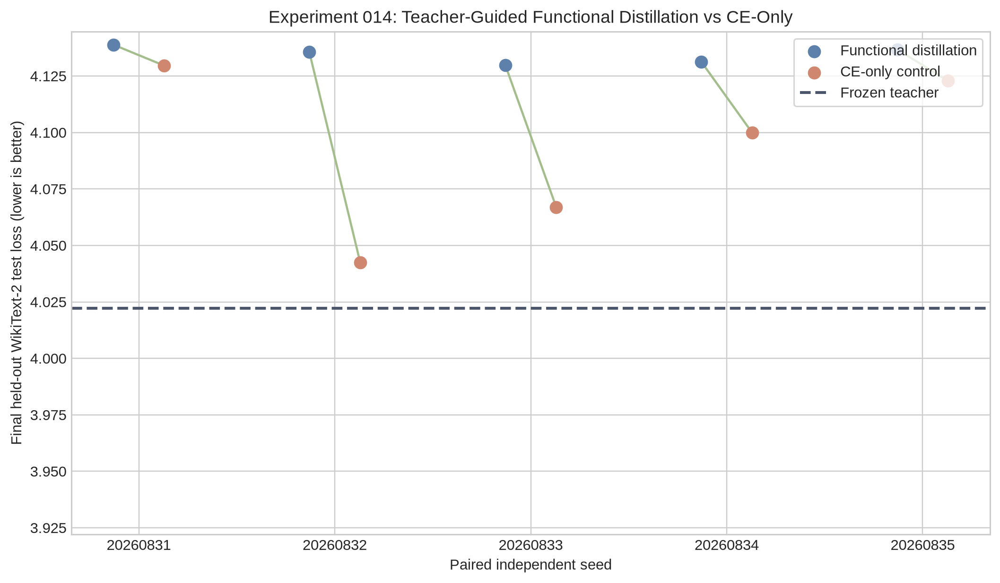

# Experiment 014: Five-Seed Causal Test of Teacher-Guided Functional Distillation

**Author:** Manus AI  
**Status:** Completed  
**Decision:** Do **not** replace a third attention layer. The tested functional-distillation objective does not establish a causal advantage over matched CE-only fitting.

## Executive Summary

Experiment 013 showed that a fresh Mamba branch fitted to Transformer attention trajectories was more effective than a direct static Transformer-to-Mamba tensor map. That result, however, did not test whether the teacher-derived trajectories and logits were better than ordinary next-token learning on the same calibration data. Experiment 014 performed that missing control.

Five paired seeds compared two identically initialized, two-layer Mamba hybrids built from the frozen `HuggingFaceTB/SmolLM-135M` checkpoint. SmolLM-135M is a 135M-parameter base language model [1]. Both conditions trained only the Mamba replacement mixers while the source backbone remained frozen. Both used the same 1,024 WikiText-2 train sequences, 720 optimizer updates, Mamba state sizes, learning rates, sequential gate schedule, 64-sequence development diagnostics, and a frozen WikiText-2 test slice of 128 sequences and 5,894 scored next tokens. WikiText provides distinct train, validation, and test splits appropriate for this separation [2].

The **functional** condition received frozen source-attention trajectories and teacher logits. The **CE-only** condition received no teacher output in its optimizer objective; it used ordinary next-token cross-entropy on the same calibration texts. The result is unambiguous for this protocol: CE-only produced lower final held-out loss in **all five paired seeds**.

| Final frozen-test metric | Functional distillation | CE-only control | CE-only − functional |
|---|---:|---:|---:|
| Mean loss ± sample SD | **4.1345 ± 0.0038** | **4.0923 ± 0.0371** | **−0.0422 ± 0.0355** |
| Gap above frozen teacher | 0.1124 | 0.0703 | — |
| Teacher-relative perplexity excess | 11.9% | 7.3% | — |
| Seeds with lower loss | 0/5 | **5/5** | — |

> **Scientific conclusion:** The original functional objective successfully matches local attention trajectories, but under this matched low-data and low-update protocol it does **not** improve end-to-end held-out language modeling beyond CE-only adaptation. This is a rigorous negative causal result for the current method—not evidence against all cross-architecture transfer.

## Question, Claim Tested, and Design

The question was deliberately narrower than “Can a Mamba hybrid speak English?” Both previous experiments already indicated that it can. Experiment 014 asked:

> **Do teacher trajectories and teacher logits provide transferable information that improves a Mamba replacement beyond the information available from equal-budget next-token CE training on the calibration text?**

The source model was a frozen SmolLM-135M Transformer-family checkpoint. Attention layers 0 and 1 were replaced sequentially by fresh Mamba mixers with state sizes 64 and 96. The wrapper formed a gated interpolation,

> `h_out = (1 − α) A(h) + α M(h)`

where `A` is frozen source attention and `M` is the trainable Mamba branch. At the endpoint `α=1`, the former attention output is entirely supplied by Mamba. The rest of the checkpoint—embeddings, MLPs, norms, output head, and all other attention layers—remained frozen. Therefore, this is a **two-layer hybrid replacement**, not a standalone Mamba conversion.

| Condition | Initial Mamba weights | Local phase | Gate phase | Teacher-derived optimizer signal |
|---|---|---|---|---|
| Functional distillation | Identical fresh random initialization per paired seed | Attention-output value matching | `0.70 KL + 0.20 CE + 0.10 local` | Yes |
| CE-only control | The same fresh random initialization per paired seed | CE at `α=1` | CE with the same gate schedule | No |

Both conditions used the exact same random Mamba initialization within each seed. The CE-only local phase used `α=1` because a Mamba branch that is fully gated out cannot receive an ordinary next-token gradient. During gate training, both conditions used the same small nonzero warm-up gate value followed by the same linear rise to one. The source endpoint was separately checked at `α=0` before optimization.

## Data Separation and Prespecified Rules

| Role | WikiText-2 raw split | Size | Permitted use |
|---|---|---:|---|
| Calibration | Train | 1,024 usable sequences | Optimization inputs only |
| Development | Validation | 64 usable sequences | Diagnostics and gate monitoring only |
| Final evaluation | Test | 128 usable sequences / 5,894 scoring tokens | Final loss, perplexity, and fixed-prompt continuations only |

The five independent paired seeds were `20260831` through `20260835`. The primary outcome was token-weighted final causal-language-model loss after both gates reached one. The prespecified causal-advantage rule required functional distillation to beat CE-only in at least four of five seeds and have a mean paired advantage of at least 0.05 nats per token. The layer-scaling rule additionally required the functional condition to remain within 0.15 nats per token of the teacher.

## Results

### Endpoint Integrity and Numerical Stability

The implementation passed all mechanical integrity checks. In every seed and in both conditions, `α=0` reproduced the frozen teacher test loss exactly within the `1e-5` tolerance. Every final loss was finite. The teacher loss on the larger frozen test protocol was 4.0221. This number is not directly comparable to Experiment 013’s 3.8146 because the latter used a different, much smaller 16-sequence test slice.

| Seed | Teacher loss | Functional loss | CE-only loss | CE-only − functional |
|---:|---:|---:|---:|---:|
| 20260831 | 4.0221 | 4.1389 | 4.1296 | −0.0093 |
| 20260832 | 4.0221 | 4.1357 | 4.0424 | −0.0933 |
| 20260833 | 4.0221 | 4.1299 | 4.0670 | −0.0629 |
| 20260834 | 4.0221 | 4.1314 | 4.0999 | −0.0315 |
| 20260835 | 4.0221 | 4.1368 | 4.1228 | −0.0139 |
| **Mean ± sample SD** | **4.0221 ± 0.0000** | **4.1345 ± 0.0038** | **4.0923 ± 0.0371** | **−0.0422 ± 0.0355** |

A positive `CE-only − functional` value would favor functional distillation. All five values are negative. An exact five-observation bootstrap over 3,125 resamples produced a descriptive 95% percentile interval of **[−0.0713, −0.0156]** nats per token for the mean paired difference. This interval should not be overstated as a definitive inferential test at `n=5`, but its direction agrees with every individual paired comparison.

| Prespecified check | Result | Assessment |
|---|---:|---|
| Exact teacher endpoint at `α=0` | 5/5 paired seeds, both conditions | **Pass** |
| Finite endpoint loss | 5/5 paired seeds, both conditions | **Pass** |
| Functional wins in at least 4/5 seeds | 0/5 | **Fail** |
| Functional mean paired advantage at least 0.05 | −0.0422 | **Fail** |
| Functional teacher gap no larger than 0.15 | 0.1124 | **Pass** |
| Permission to add a third layer | All requirements must pass | **Denied** |

### Local Fit Was Strong but Did Not Predict Global Quality

The result is scientifically useful because it identifies the failure mode. The functional condition did achieve far better layer-1 attention-output alignment on development trajectories than CE-only: **NMSE 0.1489 ± 0.0027** versus **1.1650 ± 0.0528**. Yet it had worse final held-out language loss.

This dissociation means that the existing local objective is too narrow. It constrains Mamba values at observed teacher hidden states but does not guarantee that Mamba has matched the local operator geometry, the downstream distribution, or the compositional effect of sequential replacements. A lower activation NMSE is therefore not a valid proxy for a better converted language model.

### English-Generation Sanity Check

Both conditions remained capable of English-like greedy continuations. The CE-only control was qualitatively at least as coherent as the functional condition; neither condition’s fixed prompts provide evidence that functional supervision is uniquely responsible for retained language behavior.

| Seed | Functional scientific prompt | CE-only scientific prompt |
|---:|---|---|
| 20260831 | “find out the truth about the world. The scientific method is a method of …” | “find new and better ways to improve the quality of life. The scientific method …” |
| 20260832 | “find out the truth about the world. The scientific method is a systematic approach …” | “find new and useful knowledge. The scientific method is a systematic approach …” |
| 20260833 | “find out how the world works. The purpose of scientific research is to find …” | “improve the quality of life for people. The term ‘scientific research’ is …” |
| 20260834 | “find out the causes of disease and to develop new drugs and treatments. …” | “improve the quality of life. The scientific research is a process of discovery, …” |
| 20260835 | “find out the truth about the world. The scientific method is a systematic approach …” | “advance our knowledge of the world. The scientific method is a systematic approach …” |

The full fixed-prompt continuations are preserved in the aggregation artifact. They are a qualitative sanity check only; the primary evidence remains the frozen token-level test loss.

## Interpretation

Experiment 014 **changes the strength of the research claim**. It does not invalidate the observation that a Mamba branch can be made functional inside a frozen language-model hybrid with limited calibration data. It does invalidate the stronger causal interpretation that the current combination of attention-value fitting and teacher-logit KL supplies a better transfer signal than a carefully matched CE-only baseline.

Experiment 013 remains a valuable negative result against static tensor mapping: random Mamba plus post-hoc fitting beat direct projected Transformer weights in every seed. However, Experiment 014 shows that random Mamba plus ordinary low-data CE fitting can outperform the particular teacher-guided functional objective. Consequently, the current evidence does **not** yet prove that training from scratch is unwanted, nor that functional distillation has produced a superior architecture-transfer mechanism.

The appropriate statement is now more precise:

> A pretrained Transformer backbone can accommodate a newly trained Mamba replacement module while retaining useful English behavior. Under the tested equal-budget protocol, however, direct Mamba adaptation using next-token CE is better than the current teacher-trajectory and teacher-logit objective on held-out language loss.

## Biology, Genetic-Regulation, and Accelerator Physics: Productive Next Hypotheses

The user proposed drawing from genetic engineering/biology and particle accelerators. These analogies are useful only as sources of falsifiable experimental design, not as evidence by themselves.

Developmental neuroscience motivates **layer-specific plasticity windows**: sequentially timed periods and appropriately aligned experience are important features of circuit development [3]. Models of compensatory plasticity motivate bounded correction rather than unconstrained change that damages established function [4]. Developmental gene-regulatory networks further show modular subcircuits and feedback motifs that stabilize selected regulatory states [5]. The neural-transfer translation is a local, conditionally enabled adapter or gate with an explicit off-target diagnostic—not literal genetic modification.

Accelerator staging supplies the sharper interface lesson. In plasma-wakefield accelerators, high-quality transport between stages requires matching, alignment, diagnostics, and a cumulative quality budget; good local stage behavior is not enough if the staged system loses beam quality [6]. Experiment 014 displays the neural analogue: excellent local activation fit did not imply good end-to-end language behavior.

| Cross-disciplinary idea | Neural hypothesis | Required equal-budget control |
|---|---|---|
| Sequential critical periods | Open one replacement layer’s plasticity window only after the preceding interface is accepted | Fixed linear gate schedule |
| Bounded compensatory plasticity | Permit a gate increase only if frozen-development global loss and logit KL remain inside a declared budget | Unconstrained fixed schedule |
| Modular gene regulation | Use identity-initialized, rank-limited input/output adapters at the replacement interface | CE-only condition with the same adapters and parameters |
| Off-target effects | Measure all previous layers and full-model logits after a local intervention | Local-NMSE-only selection |
| Accelerator interface matching | Match Mamba’s response to small hidden-state perturbations, not only its point values | Value-only functional distillation and CE-only conditions |
| Emittance budget | Cap cumulative global degradation attributable to each accepted replacement stage | Stage selection based only on local fit |

The actionable proposal is Experiment 015: **adaptive interface matching**. It keeps the endpoint at two replacements and compares: **A**, CE-only with equal-parameter low-rank adapters; **B**, value-only functional fitting with the same adapters; and **C**, adaptive functional fitting with directional finite-difference operator matching, frozen-development gate budgets, and the same adapters. Condition C must beat A in at least four of five paired seeds, improve the directional diagnostic, and remain close to the teacher on the large frozen test slice before a third layer is attempted.

## Scaling Decision

The scaling decision is **stop at two layers**. A third attention replacement would introduce more instability before the present two-layer mechanism has demonstrated a teacher-specific advantage. The next code and compute should be allocated to Experiment 015’s causal comparison, not to 7B scaling or a larger replacement count.

| Decision | Rationale |
|---|---|
| Do not test a third replacement layer | Functional distillation failed its prespecified causal advantage in 5/5 seeds |
| Do not scale to 7B | The method is not yet validated against the matched CE-only control at 135M |
| Retain the two-layer hybrid as a test bed | It remains stable, has a large frozen test protocol, and exposes the local-versus-global mismatch |
| Test adaptive interface matching next | It directly targets the identified failure mode and retains fair controls |
| Keep static mapping as a documented negative control | Experiment 013 showed direct tensor mapping is consistently inferior to random Mamba initialization plus training |

## Reproducibility Artifacts

| Artifact | Location |
|---|---|
| Locked causal-control protocol | `research/EXPERIMENT_014_CAUSAL_CONTROL_PROTOCOL.md` |
| Experiment script | `scripts/experiment_014_causal_control.py` |
| Five raw seed outputs | `research/experiment_014_causal_control/seed_{SEED}/results.json` |
| Aggregation script | `scripts/analyze_experiment_014.py` |
| Aggregated data | `research/experiment_014_analysis/aggregate_results.json` |
| Aggregated tables and continuations | `research/experiment_014_analysis/aggregate_results.md` |
| Paired test-loss figure | `research/experiment_014_analysis/paired_held_out_test_loss.png` |
| Cross-disciplinary design | `research/CROSS_DISCIPLINARY_TRANSFER_DESIGN.md` |

## References

[1] [Hugging Face. *HuggingFaceTB/SmolLM-135M Model Card.*](https://huggingface.co/HuggingFaceTB/SmolLM-135M)

[2] [Salesforce. *WikiText Dataset Card.*](https://huggingface.co/datasets/Salesforce/wikitext)

[3] [Reh, R. K., et al. “Critical Period Regulation Across Multiple Timescales.” *Proceedings of the National Academy of Sciences* 117, no. 38 (2020).](https://www.pnas.org/doi/10.1073/pnas.1820836117)

[4] [Raman, D. V., and T. O’Leary. “Optimal Plasticity for Memory Maintenance During Ongoing Synaptic Change.” *eLife* 10 (2021): e62912.](https://pmc.ncbi.nlm.nih.gov/articles/PMC8504970/)

[5] [Davidson, E. H., and M. Levine. “Properties of Developmental Gene Regulatory Networks.” *Proceedings of the National Academy of Sciences* 105, no. 51 (2008): 20063–20066.](https://doi.org/10.1073/pnas.0806007105)

[6] [Lindstrøm, C. A. “Staging of Plasma-Wakefield Accelerators.” *Physical Review Accelerators and Beams* 24, 014801 (2021).](https://doi.org/10.1103/PhysRevAccelBeams.24.014801)
