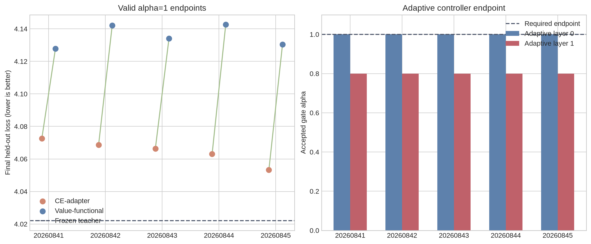

# Experiment 015: Adaptive Interface Matching and Bounded Gate Control

**Author:** Manus AI  
**Status:** Completed five-seed negative replication  
**Decision:** Do **not** add a third replacement layer or scale the method. The adaptive-interface condition did not reach the required two-layer endpoint in any seed.

## Executive Result

Experiment 015 tested the biology- and accelerator-inspired hypothesis developed after Experiment 014: a Mamba replacement might need to match not only Transformer attention values but also the local response to hidden-state perturbations, while a bounded gate controller protects global model quality during sequential replacement.

The experiment used five independent paired seeds, a frozen SmolLM-135M source, equal-parameter rank-8 residual adapters around every Mamba mixer, 1,024 WikiText-2 calibration sequences, 64 development sequences, a fixed 128-sequence untouched test set, and a fixed endpoint of two fully replaced attention layers. The three conditions were a CE-only adapter baseline, a value/logit functional-distillation condition, and an adaptive value-plus-directional-matching condition.

The result is negative but diagnostically informative. The adaptive condition improved the **development directional-response NMSE** at layer 1 from **1.0699 ± 0.0068** to **0.9912 ± 0.0031**, doing so in all five seeds. However, the bounded gate controller stopped layer 1 at **α=0.80** in **every seed**, refusing the `α=0.90` and `α=1.00` targets because the source-logit KL budget was exceeded. Since the pre-registered endpoint was `α=1` for both layers, adaptive runs received **no final test loss** and cannot be represented as successful two-layer replacements.

The valid completed endpoints again favored teacher-free CE adaptation. CE-adapter loss was **4.0647 ± 0.0073**; value/logit functional loss was **4.1354 ± 0.0067**. CE-adapter was lower-loss in **5/5** paired seeds.

> **Conclusion:** Directional matching improved its local diagnostic, but neither it nor the bounded gate controller established end-to-end cross-architecture transfer. The controller correctly prevented a partial `α=0.8` hybrid from being mislabeled as a complete two-layer Mamba replacement.

## Research Question and Controls

The question was not whether local matching could be improved. It was whether a teacher-derived interface objective could outperform both ordinary CE training and the prior value-only functional objective at the same complete two-layer endpoint.

| Condition | Trainable components | Optimization signal | Gate rule | Valid final test score? |
|---|---|---|---|---|
| **A — CE-adapter** | Fresh Mamba plus rank-8 pre/post adapters | Next-token CE only | Fixed common schedule | Yes |
| **B — value/logit functional** | Identical fresh Mamba plus identical adapters | Attention value loss, source-logit KL, CE | Fixed common schedule | Yes |
| **C — adaptive interface** | Identical fresh Mamba plus identical adapters | Value loss, finite-difference directional loss, source-logit KL, CE | Development-set bounded controller | Only if both gates reached `α=1` |

The source checkpoint, embeddings, MLPs, norms, remaining attention layers, and original attention held inside each wrapper stayed frozen. Within each seed, each condition began with the same randomly initialized Mamba and adapter weights. Thus, the experiment tested **optimization signals and gate policy**, not extra parameter capacity.

The controller was locked before the first seed. It proposed successive gate targets `0.10, 0.20, …, 1.00`; it accepted a target only if development-loss increase from the last accepted state was at most 0.05 nats/token and source-logit KL was at most 8.0. Test data were not used for any controller decision.

## Data and Budget

| Partition | Corpus split | Quantity | Allowed role |
|---|---|---:|---|
| Calibration | WikiText-2 raw train | 1,024 sequences | Optimization only |
| Development | WikiText-2 raw validation | 64 sequences | Diagnostics and adaptive gate decisions only |
| Final evaluation | WikiText-2 raw test | 128 sequences / 5,894 scored tokens | Endpoint test loss and qualitative continuations only |

Every layer received the same maximum budget in all conditions: 180 local plus 60 gate updates at layer 0, and 360 local plus 120 gate updates at layer 1, for 720 updates per completed condition. The independent paired seeds were `20260841` through `20260845`.

## Results

### Integrity Checks

All three conditions reproduced the frozen source model exactly at `α=0`, within the locked `1e−5` tolerance, in all five seeds. This verifies that the wrapper and adapters themselves did not alter source behavior before replacement. All completed CE-adapter and value-functional endpoints had finite losses.

| Integrity criterion | Outcome | Assessment |
|---|---:|---|
| Exact source endpoint at `α=0` | 5/5 seeds, all 3 conditions | **Pass** |
| Finite completed endpoint loss | 5/5 CE-adapter; 5/5 value-functional | **Pass** |
| Adaptive two-layer endpoint `α=1` | 0/5 | **Fail** |
| Adaptive endpoint threshold | At least 4/5 required | **Fail** |
| Authorization to add a third layer | All primary conditions required | **Denied** |

### Valid Completed Two-Layer Endpoints

Only conditions A and B completed their pre-registered `α=1` endpoint. Their held-out loss comparison is therefore valid.

| Seed | Frozen teacher | CE-adapter | Value-functional | CE − value |
|---:|---:|---:|---:|---:|
| 20260841 | 4.0221 | 4.0726 | 4.1279 | −0.0552 |
| 20260842 | 4.0221 | 4.0686 | 4.1421 | −0.0735 |
| 20260843 | 4.0221 | 4.0663 | 4.1340 | −0.0677 |
| 20260844 | 4.0221 | 4.0630 | 4.1426 | −0.0796 |
| 20260845 | 4.0221 | 4.0532 | 4.1304 | −0.0772 |
| **Mean ± sample SD** | **4.0221 ± 0.0000** | **4.0647 ± 0.0073** | **4.1354 ± 0.0067** | **−0.0707 ± 0.0097** |

A positive `CE − value` difference would favor value-functional distillation. The result was negative in all five seeds. Relative to the frozen teacher, CE-adapter added 0.0427 nats/token on average, while value-functional added 0.1133 nats/token. The equal-parameter adapter did not reverse the Experiment 014 causal result: **CE-only adaptation remained the stronger completed endpoint.**

### Directional Matching and Adaptive Gate Failure

The directional objective did change the intended local metric. At layer 1, the adaptive condition’s directional-response NMSE was lower in all five seeds than the value-functional condition’s metric.

| Development layer-1 diagnostic | Value-functional | Adaptive interface | Interpretation |
|---|---:|---:|---|
| Directional-response NMSE | 1.0699 ± 0.0068 | **0.9912 ± 0.0031** | Adaptive objective improved local derivative matching |
| Final accepted gate alpha | 1.00 | **0.80** | Adaptive objective failed global stage acceptance |
| Final test score | Available | **Intentionally unavailable** | No valid full endpoint exists for condition C |

The controller behavior was highly consistent. Layer 0 reached one in every seed. Layer 1 reached 0.80 in every seed. At the next proposed target, source-logit KL exceeded the locked threshold of 8.0. For seed 20260841, for example, KL was 7.45 at accepted `α=0.80`, 8.32 at rejected `α=0.90`, and 9.55 at the later rejected attempted state. The rule therefore did what it was designed to do: it prevented an uncontrolled final gate increase.

The correct scientific handling is **not** to force `α=1` after seeing the rejection or to score the `α=0.80` model on the frozen test set as if it were a complete replacement. Either action would invalidate the causal endpoint rule. The missing adaptive test results are structural failures, not numerical missing values to be averaged or imputed.

### Qualitative Language Sanity Check

The two valid endpoint conditions generated grammatical English in the fixed prompt check. CE-adapter continuations were at least as coherent as value-functional continuations, consistent with the held-out loss ordering.

| Seed | CE-adapter continuation prefix | Value-functional continuation prefix |
|---:|---|---|
| 20260841 | “advance our understanding of the world around us …” | “find out the truth about the world …” |
| 20260842 | “provide a better understanding of the world around us …” | “find out the truth about the world …” |
| 20260843 | “advance our understanding of the world around us …” | “find out the truth about the world …” |
| 20260844 | “improve the quality of life …” | “find out the truth about the world …” |
| 20260845 | “advance our knowledge of the world and to improve the quality of life …” | “find out the truth about the world …” |

These continuations are qualitative sanity checks, not the primary result. Condition C cannot be judged as a two-layer language model because it did not reach the protocol endpoint.

## Interpretation

Experiment 015 strengthens the main lesson of Experiment 014. The original value/logit functional objective had excellent local trajectory fit but worse global language loss. Adding finite-difference directional matching did improve a **local directional metric**, but the full model still could not safely advance its second replacement gate past 0.80 under the locked source-logit quality budget.

The conclusion is not that directional information is useless. It is that the tested directional objective and controller did not solve the interface problem. Three distinct statements are supported:

| Statement | Status |
|---|---|
| A frozen Transformer backbone can support a fully active two-layer fresh-Mamba hybrid after CE adaptation | **Supported** |
| The current teacher value/logit objective improves over equal-parameter CE adaptation | **Rejected in 5/5 seeds** |
| The current directional objective improves local derivative alignment | **Supported in 5/5 seeds** |
| The directional objective plus bounded controller reaches a valid complete two-layer endpoint | **Rejected in 5/5 seeds** |
| Training from scratch is generally unnecessary | **Not established** |

The biology and accelerator analogies remain useful as hypotheses and safeguards. The developmental/plasticity analogue correctly suggested that a gate should not be forced into a globally unstable state. The accelerator-interface analogue correctly predicted that pointwise values alone are insufficient, but the first attempted local-response matching measure was not enough to preserve end-to-end behavior.

## Decision and Next Research Boundary

No third layer and no 7B scale-up are scientifically justified. The project should not continue through incremental objective changes without first resolving the central contradiction: **CE-only adaptation consistently produces the best complete endpoint, while teacher-guided objectives improve local measurements without improving—or even completing—the global endpoint.**

A future protocol-development investigation may study why source-logit KL rises between gate values 0.8 and 0.9, including residual-stream distribution shifts, norm/covariance mismatch, adapter spectral constraints, and sequence-length sensitivity. That work must be explicitly labeled **protocol development**, use development-only measurements, and lock a new endpoint and control design before another five-seed test. It should not be retrofitted into Experiment 015.

The present evidence supports a narrower, honest research claim:

> Different sequence architectures can coexist in a frozen pretrained language-model backbone and retain English behavior after limited adaptation. At this scale, however, ordinary CE adaptation is more effective than the tested teacher-guided trajectory, logit, and directional objectives, and none of those objectives yet proves superior cross-architecture knowledge transfer.

## Reproducibility Artifacts

| Artifact | Path |
|---|---|
| Locked protocol | `research/EXPERIMENT_015_ADAPTIVE_INTERFACE_PROTOCOL.md` |
| Experiment implementation | `scripts/experiment_015_adaptive_interface.py` |
| Aggregation implementation | `scripts/analyze_experiment_015.py` |
| Raw five-seed outputs | `research/experiment_015_adaptive_interface/seed_{SEED}/results.json` |
| Aggregate JSON | `research/experiment_015_analysis/aggregate_results.json` |
| Aggregate Markdown table | `research/experiment_015_analysis/aggregate_results.md` |
| Endpoint/test figure | `research/experiment_015_analysis/endpoint_and_test_comparison.png` |
| Prior cross-disciplinary design | `research/CROSS_DISCIPLINARY_TRANSFER_DESIGN.md` |
