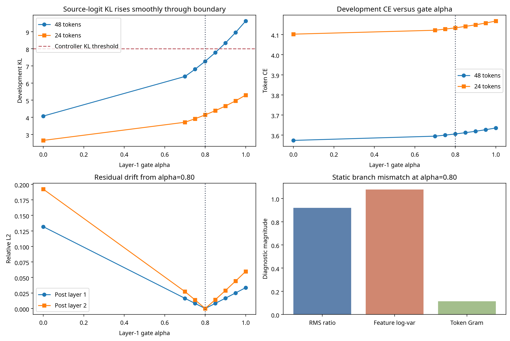

# Experiment 016: Development-Only Diagnosis of the Transformer–Mamba Interface Boundary

**Author:** Manus AI  
**Status:** Completed development-only diagnostic study  
**Scope:** Five reconstructed adaptive-interface seeds; WikiText-2 train and validation only; frozen test split never requested or scored.

## Executive Summary

Experiment 015 repeatedly stopped a second Mamba replacement layer at gate value `α=0.80`. The bounded controller rejected `α=0.90` in all five seeds because source-logit KL exceeded its fixed value of 8.0. Experiment 016 was designed to determine whether this was a sharp interface cliff, a scale/covariance mismatch, downstream amplification, or a sequence-state effect.

The result is clearer than the prior endpoint failure. The `0.80 → 0.90` event is **not a discrete numerical cliff**. Development CE and source-logit KL rise smoothly across every measured gate value. The controller threshold is crossed because a smooth, slightly accelerating mismatch curve reaches an absolute bound. Full-length development KL rose from **7.2719 ± 0.0894** at `α=0.80` to **8.3377 ± 0.1069** at `α=0.90`; the controller rejected the latter in all five reconstructions.

The branch mismatch itself is largely independent of alpha: at a fixed hidden-state input, the frozen source attention and trained Mamba outputs do not change as the gate moves. Increasing alpha merely exposes a constant Mamba-versus-attention discrepancy to the frozen downstream Transformer. The dominant measured discrepancy is **featurewise variance geometry**, not a sudden mean or RMS jump. Post-layer-2 residual drift is larger than post-layer-1 drift, supporting a limited conclusion of downstream amplification.

> **Decision:** Experiment 016 does not justify a third layer, 7B scale-up, or a general transfer claim. It identifies one narrow next hypothesis: use an equal-parameter, identity-initialized featurewise affine Mamba-output calibrator trained to match source-attention moments, and compare it rigorously with an identical CE-only calibrator.

## Protocol and Safeguards

Experiment 016 exactly reconstructed Experiment 015’s adaptive-interface branch using its five original seeds. The source was the frozen `HuggingFaceTB/SmolLM-135M` checkpoint. Layer 0 remained fully replaced at `α=1`; only layer 1 was swept through `α ∈ {0.00, 0.70, 0.75, 0.80, 0.85, 0.90, 0.95, 1.00}` after reconstruction. No parameter was optimized during the sweep.

| Safeguard | Implementation | Outcome |
|---|---|---|
| Reconstruction | Same initialization, Mamba state sizes, adapters, objectives, optimizer budgets, and seeds as Experiment 015 adaptive condition | Layer 1 reproduced final accepted `α=0.80` in 5/5 seeds |
| Data isolation | Separate requests for WikiText-2 raw train and validation only | Test partition was never requested, loaded, inspected, or scored |
| Measurement role | Development metrics only | No generalization or conversion claim is made |
| Endpoint discipline | The partial `α=0.80` hybrid remains a diagnostic state, not a complete two-layer result | No frozen-test loss is reported |

The original controller’s `batchmean` source-logit KL was retained only to reproduce its historical decision. Experiment 016 additionally recorded 24- and 48-token views as descriptive context. Because `batchmean` KL scales with the number of predicted tokens, cross-length values must not be interpreted as a clean causal context-length comparison.

## Boundary Curves

The smooth development curves are the central result. No test-set metric appears in this table.

| Layer-1 alpha | CE, 48 tokens | KL, 48 tokens | CE, 24 tokens | KL, 24 tokens | Post-L1 drift from 0.80 | Post-L2 drift from 0.80 |
|---:|---:|---:|---:|---:|---:|---:|
| 0.00 | 3.5739 ± 0.0031 | 4.0712 ± 0.0420 | 4.1023 ± 0.0049 | 2.6497 ± 0.0452 | 0.1318 | 0.1922 |
| 0.70 | 3.5949 ± 0.0057 | 6.3834 ± 0.0765 | 4.1218 ± 0.0095 | 3.7099 ± 0.0476 | 0.0164 | 0.0272 |
| 0.75 | 3.6001 ± 0.0062 | 6.8075 ± 0.0827 | 4.1274 ± 0.0102 | 3.9143 ± 0.0543 | 0.0082 | 0.0138 |
| **0.80** | **3.6059 ± 0.0068** | **7.2719 ± 0.0894** | **4.1338 ± 0.0110** | **4.1391 ± 0.0616** | **0.0000** | **0.0000** |
| 0.85 | 3.6123 ± 0.0074 | 7.7803 ± 0.0973 | 4.1409 ± 0.0117 | 4.3856 ± 0.0699 | 0.0083 | 0.0142 |
| **0.90** | **3.6193 ± 0.0080** | **8.3377 ± 0.1069** | **4.1488 ± 0.0123** | **4.6574 ± 0.0798** | **0.0166** | **0.0290** |
| 0.95 | 3.6271 ± 0.0086 | 8.9500 ± 0.1176 | 4.1577 ± 0.0129 | 4.9593 ± 0.0901 | 0.0250 | 0.0441 |
| 1.00 | 3.6357 ± 0.0092 | 9.6224 ± 0.1307 | 4.1676 ± 0.0135 | 5.2963 ± 0.1010 | 0.0336 | 0.0597 |

The threshold crossing is consistent across seeds. At `α=0.80`, original controller KL ranged from 7.4501 to 7.5978. At the rejected `α=0.90` candidate, it ranged from 8.3154 to 8.5643. Each reconstructed run therefore replicated the prior decision without accessing the test set.

| Seed | Final accepted layer-1 alpha | Original controller KL at 0.80 | Original controller KL at 0.90 | 0.90 accepted? |
|---:|---:|---:|---:|---|
| 20260841 | 0.80 | 7.4501 | 8.3154 | No |
| 20260842 | 0.80 | 7.4527 | 8.3902 | No |
| 20260843 | 0.80 | 7.4748 | 8.3475 | No |
| 20260844 | 0.80 | 7.5978 | 8.5643 | No |
| 20260845 | 0.80 | 7.5907 | 8.5341 | No |

## What Changes at 0.80 to 0.90

The mean 48-token development delta from `α=0.80` to `α=0.90` was **+0.0134 ± 0.0014** nats/token CE and **+1.0657 ± 0.0329** source-logit KL. The KL increment was about 1.20 times the preceding 0.70-to-0.80 increment. This supports **smooth, mildly accelerating degradation**; it does not support a sudden phase transition at the controller boundary.

The branch’s Mamba-versus-attention value, variance, and token-Gram diagnostics were unchanged by alpha, as expected: alpha mixes two already-computed branch outputs but does not alter either branch. At the 0.80 reference, the branch had an RMS ratio close to 0.92, an absolute per-feature log-variance-ratio diagnostic close to 1.08, and token-Gram relative error close to 0.12. The alpha sweep therefore indicates that a stable interface mismatch is being progressively injected into the frozen residual stream.

The post-layer-2 residual is more sensitive than the post-layer-1 residual. At 0.90 relative to the 0.80 reference, post-layer-1 relative drift was **0.0166 ± 0.0003**, while post-layer-2 relative drift was **0.0290 ± 0.0015**. This supports the restricted claim that the immediately following frozen block amplifies the interface discrepancy. It does not identify a unique causal operation within that block.

| Hypothesis from protocol | Development-only status | Reason |
|---|---|---|
| Sharp alpha cliff | **Not supported** | CE and KL rise smoothly through 0.80–0.90 |
| Global first/second-order interface mismatch | **Supported as a measurement signature** | Static RMS and feature-variance discrepancy is present before alpha interpolation |
| Downstream amplification | **Supported as a measurement signature** | Post-layer-2 drift exceeds post-layer-1 drift at equivalent gate changes |
| Context-length-specific failure | **Undetermined** | Legacy batchmean KL is length-dependent, so 24- versus 48-token KL is not normalized for direct comparison |
| Teacher local diagnostics prove global compatibility | **Rejected** | Earlier local value/directional improvements did not yield a safe full endpoint |

## Constrained Next Hypothesis

The most direct future causal intervention is a **featurewise output-moment calibrator** on the Mamba branch:

> `M_cal(h) = gamma ⊙ M(h) + beta`

with `gamma = 1` and `beta = 0` at initialization. The functional condition would receive a calibration-only target for the Mamba output’s per-feature mean and variance relative to source attention. Every comparator must receive the same diagonal calibrator, parameter count, initialization, calibration data, update ceiling, and gate schedule. The CE-only comparator remains mandatory.

This is not a proposed fix accepted on faith. It is a falsifiable Experiment 017 candidate because it addresses the observed **static featurewise distribution mismatch** rather than merely adding more value, KL, or directional supervision. A new gate controller should report both the historical batchmean KL and a token-normalized KL to prevent sequence-length-dependent threshold artifacts.

| Future condition | Calibrator | Training objective | Required comparison |
|---|---|---|---|
| CE-calibrator control | Same diagonal `gamma, beta` | Next-token CE only | Baseline |
| Value-functional calibrator | Same diagonal `gamma, beta` | Existing value/logit objective | Tests value supervision with equal capacity |
| Moment-functional calibrator | Same diagonal `gamma, beta` | Value/logit objective plus source-attention moment objective | Tests the specific Experiment 016 hypothesis |

Experiment 017 should be locked only after a development-only calibration pilot confirms numerical stability. It must restore an untouched test set, use independent paired seeds, and make no post-hoc changes after the first seed begins.

## Scientific Boundary

Experiment 016 narrows the research problem but does not yet establish successful Transformer-to-Mamba knowledge transfer beyond CE adaptation. The defensible cumulative conclusion is:

> A two-layer Mamba hybrid can be fully activated in a frozen language-model backbone through CE adaptation. Teacher-guided value and directional objectives improve selected local diagnostics but have not improved the matched global endpoint. The development-only boundary study attributes the current failure to a smoothly exposed branch distribution mismatch and downstream amplification, not to a discrete gate instability.

No third layer, 7B scale-up, standalone Mamba conversion, or claim that training from scratch is unnecessary is warranted by the present evidence.

## Reproducibility Artifacts

| Artifact | Path |
|---|---|
| Locked diagnostic protocol | `research/EXPERIMENT_016_INTERFACE_BOUNDARY_PROTOCOL.md` |
| Instrumented reconstruction and sweep | `scripts/experiment_016_interface_boundary.py` |
| Aggregation code | `scripts/analyze_experiment_016.py` |
| Five raw development-only measurements | `research/experiment_016_interface_boundary/seed_{SEED}/results.json` |
| Aggregate data | `research/experiment_016_analysis/aggregate_results.json` |
| Aggregate tables | `research/experiment_016_analysis/aggregate_results.md` |
| Diagnostic figure | `research/experiment_016_analysis/boundary_diagnostics.png` |
| Mechanism decision record | `research/EXPERIMENT_016_MECHANISM_DECISION.md` |
