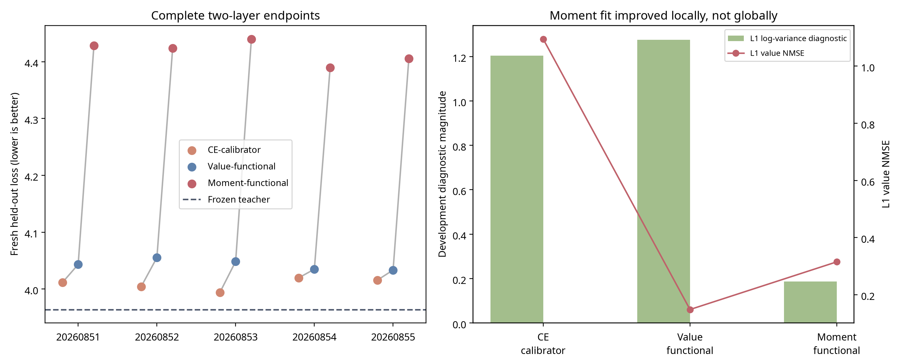

# Experiment 017: Featurewise Moment Calibration Does Not Improve Cross-Architecture Transfer

**Author:** Manus AI  
**Status:** Completed five-seed causal comparison  
**Decision:** Do **not** add a third layer, scale to 7B, or make a stronger knowledge-transfer claim. The proposed featurewise moment-calibration mechanism was rejected on a fresh held-out test slice.

## Executive Result

Experiment 016 found that alpha-gating exposed a stable Mamba-versus-attention distribution mismatch to the frozen downstream Transformer. Experiment 017 tested the narrowest resulting hypothesis: an identity-initialized, featurewise affine output calibrator on the Mamba branch, trained to match source-attention feature moments, might improve the complete two-layer endpoint beyond equal-capacity CE-only and value-functional controls.

It did not. All three conditions reached fully active two-layer endpoints and passed the exact `α=0` source-preservation check in all five seeds. On a **fresh held-out WikiText-2 test slice** not used by Experiments 014 or 015, the CE-calibrator control achieved **4.0089 ± 0.0102** loss, value-functional calibration achieved **4.0430 ± 0.0092**, and moment-functional calibration achieved **4.4173 ± 0.0199**. CE-calibrator was lower-loss than moment-functional in **5/5 paired seeds**; value-functional was also lower-loss in **5/5**.

The new moment objective did what it directly optimized: at layer 1 it reduced the development log-variance diagnostic to **0.1877 ± 0.0072**, versus **1.2757 ± 0.0836** for value-functional calibration. It nevertheless produced markedly worse language loss. Thus, matching featurewise means and variances is **not sufficient** to make the frozen downstream Transformer treat a Mamba output as interchangeable with attention.

> **Main conclusion:** the project has now tested trajectory/value matching, source-logit fitting, directional matching, bounded gates, low-rank residual adapters, and featurewise output-moment calibration. Each teacher-guided objective improved one or more local diagnostic metrics, but none beat the equal-capacity CE-only two-layer hybrid on a matched held-out language endpoint.

## Locked Causal Design

The source checkpoint was `HuggingFaceTB/SmolLM-135M`, frozen except for the two sequentially inserted fresh Mamba branches, rank-8 residual adapters, and a shared featurewise affine calibrator. The calibrator had the form:

> `M_cal(h) = gamma ⊙ [B_out M(B_in h)] + beta`

with `gamma = 1` and `beta = 0` at initialization. Every condition had identical trainable modules, random initialization within a seed, training data, update budget, layer order, and fixed gate schedule. Only the objectives differed.

| Condition | Trainable modules | Local objective | Gate objective |
|---|---|---|---|
| **CE-calibrator** | Fresh Mamba, rank-8 adapters, `gamma`, `beta` | Next-token CE | CE only |
| **Value-functional** | Identical | Source-attention value alignment | Token-normalized logit KL + CE + value |
| **Moment-functional** | Identical | Value alignment + source-attention featurewise mean/variance matching | Token-normalized logit KL + CE + value + moment |

The final evaluation used eligible WikiText-2 raw test sequences **129–256**. Earlier experiments used the first 128 eligible sequences, so this slice was fresh. All three conditions completed training before the test slice was requested or scored in each seed.

## Integrity and Endpoint Checks

| Criterion | Result | Assessment |
|---|---:|---|
| Exact source behavior at `α=0` | 5/5 seeds, all 3 conditions | **Pass** |
| Complete two-layer `α=1` endpoint | 5/5 seeds, all 3 conditions | **Pass** |
| Finite fresh-test loss | 15/15 endpoints | **Pass** |
| Moment condition beats CE in 4/5 seeds | 0/5 | **Fail** |
| Moment condition beats value-functional in 4/5 seeds | 0/5 | **Fail** |
| Moment mean advantage over CE of at least 0.05 | −0.4084 | **Fail** |
| Moment mean advantage over value of at least 0.03 | −0.3743 | **Fail** |
| Moment within 0.15 loss of frozen teacher | +0.4534 | **Fail** |
| Authorization for a third layer | All primary rules required | **Denied** |

## Fresh Held-Out Test Results

| Seed | Frozen teacher | CE-calibrator | Value-functional | Moment-functional | CE − moment | Value − moment |
|---:|---:|---:|---:|---:|---:|---:|
| 20260851 | 3.9639 | 4.0117 | 4.0325 | 4.4287 | −0.4170 | −0.3962 |
| 20260852 | 3.9639 | 4.0058 | 4.0511 | 4.4252 | −0.4194 | −0.3741 |
| 20260853 | 3.9639 | 3.9939 | 4.0545 | 4.4398 | −0.4459 | −0.3853 |
| 20260854 | 3.9639 | 4.0196 | 4.0334 | 4.3893 | −0.3697 | −0.3559 |
| 20260855 | 3.9639 | 4.0136 | 4.0437 | 4.4036 | −0.3900 | −0.3599 |
| **Mean ± sample SD** | **3.9639 ± 0.0000** | **4.0089 ± 0.0102** | **4.0430 ± 0.0092** | **4.4173 ± 0.0199** | **−0.4084 ± 0.0293** | **−0.3743 ± 0.0145** |

Positive `CE − moment` or `value − moment` differences would favor the moment-functional condition. Both were negative in every seed. CE-calibrator was only 0.0450 nats/token above the teacher on the fresh slice, whereas moment-functional was 0.4534 above it.

## Local Improvement Versus Global Failure

Moment-functional calibration substantially reduced the featurewise variance diagnostic it was designed to improve. It did not preserve the stronger attention-value approximation achieved by value-functional calibration, and neither local result predicted held-out language behavior.

| Layer-1 development diagnostic | CE-calibrator | Value-functional | Moment-functional | What it establishes |
|---|---:|---:|---:|---|
| Value NMSE | 1.0949 ± 0.0404 | **0.1479 ± 0.0019** | 0.3148 ± 0.0116 | Value fitting is best for local branch values |
| Log-variance mismatch | 1.2034 ± 0.0917 | 1.2757 ± 0.0836 | **0.1877 ± 0.0072** | Moment fitting is best for the local variance metric |
| Fresh test loss | **4.0089 ± 0.0102** | 4.0430 ± 0.0092 | 4.4173 ± 0.0199 | CE remains best at the global endpoint |

The key pattern is now replicated across several objective families: **better local matching does not imply better global compatibility**. The featurewise moment loss reduced the intended variance error by roughly 85% relative to value-functional calibration, yet it worsened language loss by 0.3743 nats/token relative to that condition.

The token-normalized KL safety trace also does not rescue the moment condition. Its mean layer-1 post-gate development KL was 0.6106, compared with 0.2363 for value-functional. The `0.22` threshold was a recorded protocol-development flag rather than a stopping rule; changing the objective or gate schedule after observing the result would be post-hoc and was not done.

## Interpretation

Experiment 017 rejects the specific causal hypothesis that featurewise mean-and-variance matching is the missing Transformer-to-Mamba interface property. It does not prove that all statistical interface calibration is impossible. It proves that this diagonal featurewise mechanism, at this loss weighting and budget, creates a worse global endpoint despite improving its own local diagnostic.

A cautious interpretation is that the frozen downstream network depends on **joint residual-stream geometry and end-to-end computation**, not merely individual feature moments, branch values, or one-step directional responses. The current frozen-hybrid setup gives CE-only adaptation an advantage because CE can optimize the actual global language behavior, while teacher-guided local constraints can divert limited capacity toward proxies that are not causally sufficient.

| Research claim | Status after Experiment 017 |
|---|---|
| A fully active two-layer fresh-Mamba hybrid can retain fluent English under limited CE adaptation | **Supported** |
| Source-attention value matching beats equal-capacity CE adaptation | **Rejected in matched replications** |
| Featurewise moment matching repairs the value-to-language gap | **Rejected in 5/5 fresh-test seeds** |
| A local diagnostic by itself validates cross-architecture knowledge transfer | **Rejected** |
| Training from scratch is generally unnecessary | **Not established** |

## Scaling Decision and Next Research Boundary

The correct decision is to **stop incremental local-objective variations**. A third layer or 7B run would multiply compute without addressing the repeated causal result. The research should instead move to a conceptual design stage before another conversion benchmark.

A defensible next question is whether a Mamba replacement should be treated as a standalone approximation to attention at all. An alternative architecture-level hypothesis would preserve a learned residual interface transport map that is optimized end-to-end against frozen-backbone language behavior, with teacher signals used as diagnostics rather than as primary local objectives. This remains an untested proposal, not a recommended success claim.

Before any new large experiment, the project should create an evidence synthesis that specifies which observations require a new architecture, which are compatible with ordinary distillation, and what result would uniquely support cross-architecture transfer over CE-only adaptation. That synthesis must precede a new locked causal protocol.

## Reproducibility Artifacts

| Artifact | Path |
|---|---|
| Locked protocol | `research/EXPERIMENT_017_MOMENT_CALIBRATION_PROTOCOL.md` |
| Experiment implementation | `scripts/experiment_017_moment_calibration.py` |
| Aggregation implementation | `scripts/analyze_experiment_017.py` |
| Raw five-seed output | `research/experiment_017_moment_calibration/seed_{SEED}/results.json` |
| Aggregate data | `research/experiment_017_analysis/aggregate_results.json` |
| Aggregate table | `research/experiment_017_analysis/aggregate_results.md` |
| Endpoint and diagnostic figure | `research/experiment_017_analysis/fresh_test_and_local_diagnostics.png` |
