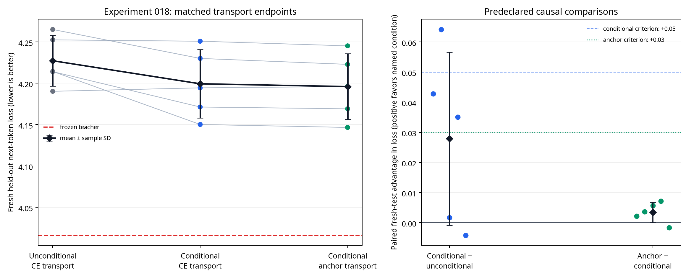

# Experiment 018 Report: End-to-End Residual Interface Transport

**Author:** Manus AI  
**Status:** Completed five-seed, three-condition causal comparison  
**Decision:** **Do not add a third replacement layer, scale to 1B/7B, or introduce 4-bit quantization.** The residual-transport architecture showed a small but insufficient conditional-interface signal, and the teacher-derived downstream anchor did not establish the required causal advantage.

## Executive Summary

Experiments 014–017 showed that Mamba branches trained to imitate Transformer attention values, directional responses, or featurewise moments could improve their selected local diagnostic while losing to matched CE-only adaptation on held-out language loss. Experiment 018 tested a genuinely different formulation: rather than making Mamba imitate attention directly, it inserted a deployed, identity-initialized residual **interface transport map** after Mamba and optimized the full frozen Transformer–Mamba hybrid primarily through next-token cross-entropy.

The study used the frozen `HuggingFaceTB/SmolLM-135M` checkpoint, a 135M-parameter base language model [1], and sequentially replaced attention layers 0 and 1 with fresh Mamba mixers. Every condition had the same Mamba capacity, rank-16 transport module, initialization within paired seed, data, budget, gate schedule, and frozen backbone. WikiText-2 was split into calibration, development, and a new fresh final evaluation slice; the latter used eligible raw-test sequences 257–384 and was loaded only after all three conditions had finished training in each seed [2].

The input-conditioned CE transport map beat the capacity-matched unconditional CE transport in **4/5 seeds**, with a mean fresh-test advantage of **0.0279 ± 0.0287 nats/token**. The conditional downstream-anchor transport also beat conditional CE transport in **4/5 seeds**, but only by **0.0034 ± 0.0034 nats/token**. Both effects missed their predeclared mean thresholds—0.05 and 0.03 respectively—and the anchored condition remained **0.1796 nats/token** above the frozen teacher. Therefore neither the conditional transport architecture nor the teacher-derived downstream anchor satisfies the standard for a scalable transfer mechanism.

> **Scientific conclusion:** An input-conditioned, end-to-end transport map may be directionally more useful than an unconditional capacity-matched map, but the present five-seed evidence does not establish the required effect size. The teacher-derived downstream anchor adds no meaningful causal benefit under the locked protocol. This is a qualified negative result, not evidence that training from scratch is unnecessary or that a Transformer checkpoint has been successfully converted into Mamba.

## Research Question

The study asked two nested questions.

| Comparison | Research question | Predeclared success rule |
|---|---|---|
| Conditional CE transport (B) versus unconditional CE transport (A) | Does a deployed transport map conditioned on the residual input improve the full hybrid endpoint beyond equal transport capacity? | B wins at least 4/5 paired seeds and mean `A − B ≥ 0.05` nats/token |
| Conditional downstream-anchor transport (C) versus conditional CE transport (B) | Does a small teacher-derived target measured **after** the intervention add value beyond the identical CE-optimized transport map? | C wins at least 4/5 paired seeds and mean `B − C ≥ 0.03` nats/token |

The first question concerns an **architecture effect**. The second is the essential teacher-specific transfer question. Even a positive B-versus-A outcome would not demonstrate knowledge transfer from the Transformer unless C also exceeded B under matched conditions.

## Method

### Frozen Hybrid Endpoint

The source checkpoint was kept frozen except for the two newly inserted Mamba transport branches. For an attention input `h`, frozen source attention `A`, Mamba mixer `M`, and trainable transport `T`, the wrapper was

> `y = (1 − α) A(h) + α T(h, M(h))`.

At `α=0`, source attention supplies the output exactly. At `α=1`, attention no longer contributes to the active layer output. The entire source backbone—embeddings, layer norms, MLPs, output head, all other attention modules, and all teacher parameters—remained frozen.

The deployed transport branch was

> `T(h,m) = m + W_up SiLU(W_down q(h,m))`,

where `m = M(h)` and `W_down` and `W_up` form a rank-16 bottleneck. `W_up` was initialized to zero, so the transport correction was exactly zero at initialization. This identity-style initialization is a safeguard inspired by function-preserving-transform principles, but it is **not** an exact Transformer-to-Mamba function-preserving transformation [3].

### Matched Conditions

| Condition | Transport input | Optimization objective | Teacher-derived optimizer signal |
|---|---|---|---|
| **A — Unconditional CE transport** | Three copies of normalized Mamba output | Next-token CE | None |
| **B — Conditional CE transport** | Normalized input, normalized Mamba output, and their difference | Next-token CE | None |
| **C — Conditional downstream-anchor transport** | Same conditional input as B | `CE + 0.05 × downstream anchor` | Post-intervention anchor only |

The teacher auxiliary in C was intentionally measured after the attention-output intervention. It compared the frozen block output reached from the hybrid branch with the source block output, after parameter-free RMS normalization. No condition used attention-value regression, moment matching, directional finite differences, teacher-logit KL, static projection, or a teacher input at inference. This choice follows the research motivation that heterogeneous feature coordinates need not be directly comparable [4] [5].

### Data Separation and Fixed Budget

| Role | WikiText-2 raw partition | Quantity | Permitted use |
|---|---|---:|---|
| Calibration | Train | 1,024 eligible sequences | Optimization only |
| Development | Validation | 64 eligible sequences | Recorded diagnostics only |
| Final evaluation | Test sequences 257–384 | 128 eligible sequences / 5,661 scored tokens | Final loss and fixed prompts only |

The final slice was deliberately distinct from Experiment 014–015’s first 128 eligible test sequences and Experiment 017’s 129–256 slice. The experiment enforced separate train and validation loading before optimization. It requested the test split only after all three conditions had completed all 720 updates in the active seed.

Each condition received 300 updates while replacing layer 0 and 420 updates while replacing layer 1, for 720 updates per condition. Alpha began at 0.05 for ten warm-up updates and rose linearly to one. The five paired seeds were `20260861` through `20260865`.

## Integrity Checks

All mechanical safeguards passed. Every condition in every seed exactly reproduced the frozen teacher on the fresh test slice at `α=0` within the predeclared `1e−5` tolerance. All 15 alpha-one endpoints were finite, and both replacement layers reached alpha one in all five seeds. The final-slice-loaded-after-training field was true for all seeds.

| Integrity criterion | Result | Assessment |
|---|---:|---|
| Exact source preservation at alpha zero | 5/5 seeds, all 3 conditions | **Pass** |
| Complete two-layer alpha-one endpoint | 5/5 seeds, all 3 conditions | **Pass** |
| Finite fresh-test endpoint losses | 15/15 endpoints | **Pass** |
| Final slice loaded only after all conditions trained | 5/5 seeds | **Pass** |

These checks establish that the comparison is valid for this fixed setup. They do not themselves support a knowledge-transfer claim.

## Fresh Held-Out Results

| Seed | Frozen teacher | Unconditional CE | Conditional CE | Conditional anchor | Conditional advantage `A − B` | Anchor advantage `B − C` |
|---:|---:|---:|---:|---:|---:|---:|
| 20260861 | 4.0162 | 4.2140 | 4.1712 | 4.1690 | 0.0428 | 0.0022 |
| 20260862 | 4.0162 | 4.2142 | 4.1501 | 4.1465 | 0.0641 | 0.0036 |
| 20260863 | 4.0162 | 4.2524 | 4.2508 | 4.2451 | 0.0016 | 0.0056 |
| 20260864 | 4.0162 | 4.2650 | 4.2300 | 4.2228 | 0.0350 | 0.0072 |
| 20260865 | 4.0162 | 4.1902 | 4.1944 | 4.1960 | −0.0042 | −0.0016 |
| **Mean ± sample SD** | **4.0162 ± 0.0000** | **4.2271 ± 0.0307** | **4.1993 ± 0.0413** | **4.1959 ± 0.0397** | **0.0279 ± 0.0287** | **0.0034 ± 0.0034** |

A positive `A − B` favors conditional transport. A positive `B − C` favors the teacher-anchored condition. Conditional transport was directionally favored in four seeds, but the mean was only 55.8% of the required 0.05 effect. The anchor was also directionally favored in four seeds, but its mean was only 11.3% of the required 0.03 effect. It would be statistically and scientifically inappropriate to treat a four-of-five count alone as success when the predeclared effect-size requirement failed.

### Development Diagnostics

| Condition | Layer-1 development CE | Token-normalized source-logit KL | Transport correction RMS / Mamba RMS | Downstream-anchor diagnostic |
|---|---:|---:|---:|---:|
| Unconditional CE transport | 3.7474 ± 0.0274 | 0.8365 ± 0.0275 | 0.2631 ± 0.0745 | — |
| Conditional CE transport | 3.7190 ± 0.0336 | 0.7941 ± 0.0312 | 0.2178 ± 0.0770 | — |
| Conditional anchor transport | 3.7148 ± 0.0335 | 0.7884 ± 0.0318 | 0.2202 ± 0.0759 | 0.0613 ± 0.0016 |

The development diagnostics match the direction of the fresh-test ordering: the conditional branches had lower development CE and source-logit KL than the unconditional branch, and the anchor condition was slightly lower than conditional CE. However, the earlier project history shows that diagnostics are not sufficient evidence of global transfer; here they are descriptive consistency checks only.

## Predeclared Decision Table

| Criterion | Result | Assessment |
|---|---:|---|
| Conditional CE transport beats unconditional CE transport | 4/5 seeds | Partial directional signal |
| Conditional mean advantage at least 0.05 | 0.0279 | **Fail** |
| Downstream anchor beats conditional CE transport | 4/5 seeds | Partial directional signal |
| Anchor mean advantage at least 0.03 | 0.0034 | **Fail** |
| Anchor within 0.15 loss of frozen teacher | 0.1796 | **Fail** |
| Authorization for third replacement layer | All criteria required | **Denied** |
| Authorization for 1B/7B scaling or 4-bit quantization study | Two-layer teacher-specific mechanism required | **Denied** |

## Interpretation

Experiment 018 differs from prior experiments in one favorable respect: it does not produce a stark local-versus-global reversal. The input-conditioned transport map improved both development diagnostics and final fresh-test loss relative to its unconditional parameter-matched counterpart in four seeds. This is evidence that a residual-state-conditioned **deployed interface** is a more promising direction than static mapping or isolated feature targets.

That limited signal does not meet the protocol’s causal threshold. More importantly, the teacher-specific downstream anchor changed the average endpoint by only 0.0034 nats/token relative to the same conditional CE transport. This result rejects the particular claim that the tested frozen-block anchor transfers a material teacher-specific advantage under the available data, parameter budget, and loss weight.

The correct cumulative statement is therefore:

> A fully active two-layer Transformer–Mamba hybrid can be trained with a deployed residual transport map and retain coherent English behavior. Input conditioning gives a small, non-qualifying improvement over an unconditional capacity-matched transport map. The tested teacher-derived downstream anchor does not establish a meaningful advantage beyond CE-only conditional transport.

This remains a **hybrid adaptation** result. It is not a conversion of SmolLM into a standalone Mamba model, and it does not show that pretraining can generally be avoided.

## Scaling Decision and Research Boundary

No additional replacement layer, 1B-parameter model, 7B model, or 4-bit quantized variant should be run now. Scaling a mechanism before it meets its small-model teacher-specific causal threshold would multiply resource use while leaving the core question unresolved.

The next responsible step is **development-only protocol diagnosis**, not another five-seed endpoint claim. It should determine why the layer-0 transport correction sometimes grew to a large RMS ratio during training, despite the rank-16 bottleneck and zero output initialization. That work should measure correction spectra, correction-to-residual ratios across alpha, and gradient allocation between Mamba and transport on the validation split. Any new mechanism must then be pre-registered with a parameter-matched CE transport baseline before fresh-test evaluation.

A stronger future architecture must make a falsifiable case for why teacher information changes the globally relevant transport computation, not merely a local or downstream diagnostic. Until then, the narrow research conclusion remains that **teacher-free CE is the best demonstrated training signal for this two-layer frozen-hybrid setting**.

## Reproducibility Artifacts

| Artifact | Path |
|---|---|
| Locked protocol | `research/EXPERIMENT_018_RESIDUAL_INTERFACE_TRANSPORT_PROTOCOL.md` |
| Architecture design | `research/E018_RESIDUAL_INTERFACE_TRANSPORT_DESIGN.md` |
| Experiment implementation | `scripts/experiment_018_residual_interface_transport.py` |
| Aggregation implementation | `scripts/analyze_experiment_018.py` |
| Five raw paired results | `research/experiment_018_residual_interface_transport/seed_{SEED}/results.json` |
| Per-seed logs | `research/experiment_018_residual_interface_transport/seed_{SEED}.log` |
| Aggregate JSON | `research/experiment_018_analysis/aggregate_results.json` |
| Aggregate table and fixed prompts | `research/experiment_018_analysis/aggregate_results.md` |
| Endpoint and causal-comparison figure | `research/experiment_018_analysis/fresh_test_transport_comparison.png` |

## References

[1] [Hugging Face. *HuggingFaceTB/SmolLM-135M Model Card.*](https://huggingface.co/HuggingFaceTB/SmolLM-135M)

[2] [Salesforce. *WikiText Dataset Card.*](https://huggingface.co/datasets/Salesforce/wikitext)

[3] [Jaderberg. *Towards a More Complete Theory of Function Preserving Transforms* (2024 version).](https://arxiv.org/abs/2410.11038)

[4] [Liu et al. *Cross-Architecture Knowledge Distillation* (ACCV 2022).](https://openaccess.thecvf.com/content/ACCV2022/html/Liu_Cross-Architecture_Knowledge_Distillation_ACCV_2022_paper.html)

[5] [Wang et al. *One-for-All: Bridge the Gap Between Heterogeneous Architectures in Knowledge Distillation* (NeurIPS 2023).](https://neurips.cc/virtual/2023/poster/72626)
