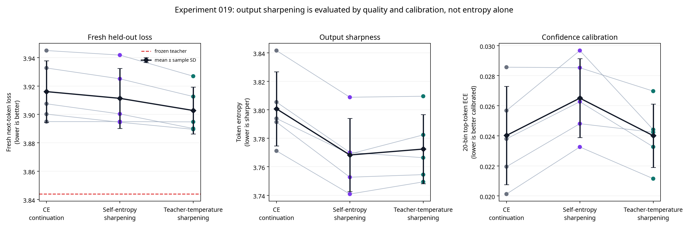

# Experiment 019 Report: Teacher-Sharpened Output Fine-Tuning

**Author:** Manus AI

**Status:** Complete, preregistered five-seed test
**Decision:** **Negative for the prespecified teacher-specific transfer claim; no third layer, 1B/7B scaling, or quantization is authorized.**

## Executive Finding

Experiment 019 tested whether a short teacher-temperature output-sharpening stage could improve a **fully deployed two-layer SmolLM-135M-to-Mamba hybrid** beyond two equal-budget controls: ordinary cross-entropy (CE) continuation and non-teacher self-entropy sharpening. The result had a favorable direction but did **not** meet the locked effect-size requirement.

Teacher-temperature sharpening achieved the lowest fresh held-out loss in **all 5/5 paired seeds**. Its mean advantage was **0.0133 nats/token over CE** and **0.0086 nats/token over self-entropy sharpening**. The preregistered acceptance rule required both advantages to be at least **0.0300 nats/token**. Both effect-size tests therefore failed, even though the win-count tests passed.

> **Conclusion:** The data show a small, directionally teacher-specific output-stage improvement under this exact two-layer hybrid protocol, but not a sufficiently large effect to support the intended knowledge-transfer claim or to justify scaling. Lower entropy occurred as designed, yet it was not the deciding evidence.

This result is neither a pure-Mamba conversion nor evidence that pretraining can be skipped. It remains a small frozen Transformer–Mamba hybrid in which only the fresh Mamba modules and their rank-16 conditional residual transport maps were trained.

## Question and Locked Design

The source model was `HuggingFaceTB/SmolLM-135M`. Attention in layers 0 and 1 was replaced by fresh Mamba mixers with state sizes 64 and 96. The frozen source embedding, norms, MLPs, output head, and teacher remained unchanged. The deployed interface was the conditional residual transport map

> \(y=(1-\alpha)A(h)+\alpha T_\theta(h,M_\phi(h))\),

with a rank-16, exact-zero-initialized correction. Thus \(\alpha=0\) must reproduce the frozen source exactly and the final endpoint requires both active gates at \(\alpha=1\). Each paired condition received the same 720-update conditional-CE pre-stage, followed by 180 output-stage updates at the fully swapped endpoint.

| Condition | Output-stage objective | Purpose of the comparison |
|---|---|---|
| **A — CE continuation** | \(CE\) | Measures ordinary extra adaptation at the identical endpoint and update budget. |
| **B — Self-entropy sharpening** | \(CE + 0.05H(p_S)\) | Measures non-teacher output concentration. |
| **C — Teacher-temperature sharpening** | \(CE + 0.20KL(p_T^{0.7}\|p_S)\) | Tests whether low-temperature frozen-teacher preferences add a teacher-specific benefit. |

The pre-stage, initialization, trainable parameter count, optimizer, learning-rate schedule, calibration sequence order, alpha schedule, output-stage budget, endpoint, prompts, and final evaluation were paired exactly. The fresh final WikiText-2 raw test partition comprised eligible sequences 385–512 and was loaded only after all three conditions had completed training in each seed. The immutable protocol is available in [`EXPERIMENT_019_OUTPUT_SHARPENING_PROTOCOL.md`](EXPERIMENT_019_OUTPUT_SHARPENING_PROTOCOL.md).

## Fresh Held-Out Results

The primary endpoint was token-weighted next-token loss on the fresh final partition. Positive advantages in the final two columns favor teacher-temperature sharpening.

| Seed | Frozen teacher loss | A: CE loss | B: Self-sharp loss | C: Teacher-sharp loss | A − C | B − C |
|---:|---:|---:|---:|---:|---:|---:|
| 20260871 | 3.8438 | 3.9327 | 3.9251 | 3.9126 | 0.0201 | 0.0125 |
| 20260872 | 3.8438 | 3.8949 | 3.8949 | 3.8947 | 0.0002 | 0.0002 |
| 20260873 | 3.8438 | 3.9450 | 3.9418 | 3.9269 | 0.0181 | 0.0149 |
| 20260874 | 3.8438 | 3.9002 | 3.8945 | 3.8895 | 0.0107 | 0.0050 |
| 20260875 | 3.8438 | 3.9075 | 3.9003 | 3.8900 | 0.0174 | 0.0103 |
| **Mean ± sample SD** | **3.8438 ± 0.0000** | **3.9161 ± 0.0217** | **3.9113 ± 0.0212** | **3.9028 ± 0.0165** | **0.0133 ± 0.0081** | **0.0086 ± 0.0059** |

The teacher-temperature condition was lower-loss than both controls in every paired replication, but its average advantage was materially below the predeclared 0.03-nats/token threshold. In particular, seed 20260872's advantage was approximately 0.0002 nats/token against either control. The appropriate interpretation is therefore **a non-qualifying directional signal**, not confirmed teacher-specific transfer.

## Sharpness and Calibration Are Diagnostics, Not Success Substitutes

Both sharpening conditions reduced fresh-token entropy relative to CE continuation. However, the more-entropic teacher-temperature condition had better held-out loss than the more sharply concentrated self-entropy condition. This directly illustrates why a reduced entropy statistic cannot establish transfer quality by itself.

| Condition | Fresh token entropy, mean ± sample SD | Change from CE | Fresh 20-bin top-token ECE, mean ± sample SD | Mean loss gap to frozen teacher |
|---|---:|---:|---:|---:|
| A — CE continuation | 3.8007 ± 0.0260 | — | 0.0240 ± 0.0033 | 0.0722 |
| B — Self-entropy sharpening | 3.7683 ± 0.0257 | −0.0324 | 0.0265 ± 0.0026 | 0.0675 |
| C — Teacher-temperature sharpening | 3.7725 ± 0.0243 | −0.0283 | 0.0240 ± 0.0021 | 0.0589 |

Teacher-temperature sharpening did **not** create the lowest entropy: self-entropy sharpening did. Yet teacher-temperature sharpening had the lowest loss. Conversely, self-entropy sharpening had a higher mean ECE than CE, while the teacher-temperature condition's mean ECE change from CE was **−0.000015** and its largest per-seed increase was **0.00229**, safely below the permitted 0.01. The findings reinforce the design premise that confidence concentration, calibration, and language likelihood are different quantities. Entropy-related methods can change confidence without proving language-quality or architecture-transfer gains [1] [2] [3]. Fine-tuning may also change calibration independently of accuracy [4] [5].

## Integrity, Scale Readiness, and Acceptance Checks

All endpoint and data-isolation checks succeeded. At \(\alpha=0\), every condition exactly reproduced the frozen teacher loss in all five seeds; the maximum measured deviation was 0.0, below the required \(10^{-5}\). Every seed finished with both gates at \(\alpha=1\), every final loss was finite, and the final test partition was not loaded until all three conditions had trained. The fixed greedy continuations were coherent in 5/5 seeds; they are a sanity check only and were not used to rank methods.

| Prespecified requirement | Observed result | Assessment |
|---|---:|---|
| Alpha-zero source preservation within \(10^{-5}\), alpha-one endpoint, and final-slice isolation | 5/5; maximum loss deviation 0.0 | **Pass** |
| Finite final losses | 15/15 condition-seed endpoints | **Pass** |
| B lowers mean entropy versus A | 0.0324 nats/token reduction | **Pass; descriptive only** |
| C lowers mean entropy versus A | 0.0283 nats/token reduction | **Pass; descriptive only** |
| C beats A on fresh loss in at least 4/5 paired seeds | 5/5 | **Pass** |
| Mean \(A-C\) at least 0.03 nats/token | 0.0133 | **Fail** |
| C beats B on fresh loss in at least 4/5 paired seeds | 5/5 | **Pass** |
| Mean \(B-C\) at least 0.03 nats/token | 0.0086 | **Fail** |
| C fresh ECE no more than 0.01 above A | maximum increase 0.00229 | **Pass** |
| C within 0.15 nats/token of frozen teacher | maximum gap 0.0831 | **Pass** |
| Coherent fixed greedy continuations | 5/5 | **Pass; sanity check only** |
| Authorization for third layer, 1B/7B, or 4-bit work | All prior criteria required | **Denied** |

Because both required mean teacher-specific advantages failed, the acceptance gate is closed despite the consistent favorable rank ordering. No retrospective modification of temperature, KL coefficient, entropy coefficient, step budget, data slice, or acceptance threshold is valid for Experiment 019.

## Interpretation and Limits

The **narrowest defensible finding** is that, for this exact short output stage, frozen-teacher temperature targets yielded a repeatable but small improvement over matched CE and self-entropy controls. It is evidence worth retaining as a quantitative observation, but it falls short of the protocol's minimum practical effect. Calling it a successful knowledge transfer would overstate the data.

The experiment also rejects a simpler explanation: output sharpness alone is not responsible for the observed loss ordering. Self-entropy sharpening achieved the largest mean entropy reduction but did not match teacher-temperature sharpening in fresh loss. Equally, fluent fixed continuations do not resolve the causal question, because every condition uses a common pretrained frozen backbone and common transport pre-stage.

The result is limited to a 135M-parameter source model, two sequentially swapped layers, fresh Mamba mixers embedded in a frozen Transformer backbone, rank-16 conditional transport, 180 output-stage updates, five seeds, and the defined 128-sequence final slice. It does not establish standalone Mamba competence, direct attention-to-Mamba weight transplantation, broad generalization beyond the fresh slice, or scale readiness. These limits are substantive rather than cosmetic: prior experiments already showed that local matching and apparent fluency do not reliably predict the deployed endpoint.

## Recommendation

**Do not scale this mechanism now.** The correct research action is to preserve Experiment 019 as a non-qualifying result and keep 1B/7B, third-layer, quantization, and deployment work blocked. If this hypothesis is revisited, it must be a new preregistered small-model experiment with a genuinely new mechanism and independently specified controls; it must not tune the current protocol against the completed final test partition.

The reproducible five-seed data, aggregation script, machine-readable statistics, fixed continuations, and paired visualization are stored under [`research/experiment_019_output_sharpening/`](experiment_019_output_sharpening/), [`research/experiment_019_analysis/`](experiment_019_analysis/), and [`scripts/analyze_experiment_019.py`](../scripts/analyze_experiment_019.py).

## References

[1] [Carlsson et al. *The Hyperfitting Phenomenon: Sharpening and Stabilizing LLMs for Open-Ended Text Generation.* ICLR 2025.](https://proceedings.iclr.cc/paper_files/paper/2025/hash/acfb8a98d2af3b3b8d5a9ffa979954a7-Abstract-Conference.html)

[2] [Huang et al. *Self-Improvement in Language Models: The Sharpening Mechanism.* ICLR 2025.](https://proceedings.iclr.cc/paper_files/paper/2025/hash/bee8c2bc757f6bbc3efd7cf1b979f0c9-Abstract-Conference.html)

[3] [Pereyra et al. *Regularizing Neural Networks by Penalizing Confident Output Distributions.* 2017.](https://arxiv.org/abs/1701.06548)

[4] [Xie et al. *Calibrating Language Models with Adaptive Temperature Scaling.* EMNLP 2024.](https://aclanthology.org/2024.emnlp-main.1007/)

[5] [Kapoor et al. *Calibration-Tuning: Teaching Large Language Models to Know What They Don't Know.* Uncertainty in NLP 2024.](https://aclanthology.org/2024.uncertainlp-1.1/)
