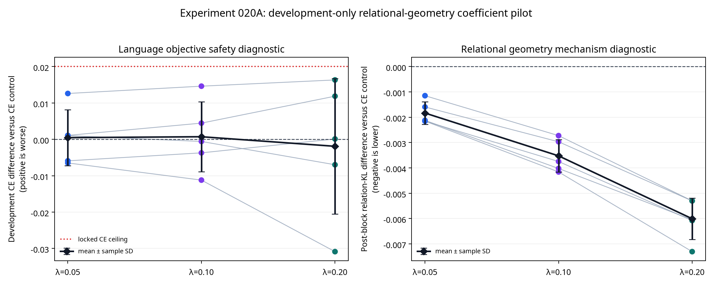

# Experiment 020A Report: Development-Only Relational-Geometry Coefficient Pilot

**Author:** Manus AI

**Status:** Complete five-seed development-only pilot. No test data were requested, loaded, tokenized, inspected, or scored.

**Decision:** The locked selection rule chooses **\(\lambda=0.20\)** for a future, separately preregistered endpoint experiment. This is **not** evidence of successful knowledge transfer, fresh-test benefit, scaling readiness, or Mamba conversion.

## Purpose

Experiment 020A was a safety and coefficient-selection pilot for the post-block token-relation geometry auxiliary proposed after Experiments 018–019. The candidate auxiliary compares row-wise token-relation distributions at the input of frozen decoder layer 2, after the two active Mamba transport substitutions have already contributed. It was motivated by the remaining interface bottleneck: directly matching individual hidden coordinates, values, directions, moments, or sharpened outputs has not produced a qualifying teacher-specific endpoint advantage.

The pilot’s sole role was to select one coefficient on development data. It was explicitly prohibited from loading the WikiText-2 test split. Every seed result records `test_split_requested: false`, and the implementation contains no test-split loader.

## Locked Design

The frozen source was `HuggingFaceTB/SmolLM-135M`. Layers 0 and 1 used fresh Mamba mixers with state sizes 64 and 96 and the same rank-16, identity-initialized conditional transport map used in Experiment 018. Each condition received 300 layer-0 updates and 420 layer-1 updates, with identical initialization within each seed, calibration sequence order, optimizer, alpha schedule, trainable parameters, and development partition.

For teacher and hybrid token representations \(H_T\) and \(H_S\) captured at the layer-2 input, the auxiliary used row-wise distributions of normalized token-similarity matrices:

> \(L_{rel}=\operatorname{mean}_i\operatorname{KL}(R(H_T)_i\parallel R(H_S)_i)\), with relation temperature \(\tau_r=0.20\).

| Condition | Objective | Coefficient |
|---|---|---:|
| Conditional CE transport | \(CE\) | 0.00 |
| Relational geometry pilot | \(CE+\lambda L_{rel}\) | 0.05 |
| Relational geometry pilot | \(CE+\lambda L_{rel}\) | 0.10 |
| Relational geometry pilot | \(CE+\lambda L_{rel}\) | 0.20 |

The five paired seeds were 20260881–20260885. The development partition was WikiText-2 raw validation eligible sequences 65–128; calibration used the first 1,024 eligible training sequences. The locked protocol is [`EXPERIMENT_020A_RELATIONAL_GEOMETRY_PILOT_PROTOCOL.md`](EXPERIMENT_020A_RELATIONAL_GEOMETRY_PILOT_PROTOCOL.md).

## Integrity and Data Isolation

Every safety condition passed. All four conditions finished both gates at alpha one in all five seeds, all endpoint diagnostic values were finite, and alpha-zero reconstruction exactly reproduced the frozen teacher validation loss. The maximum alpha-zero loss deviation was 0.0 in every condition and seed. The test-access flag was false in all five result files.

| Safeguard | Result | Assessment |
|---|---:|---|
| Requested WikiText-2 test split | 0/5 seeds | **Pass** |
| Finite development endpoints | 20/20 condition-seed endpoints | **Pass** |
| Both active gates at alpha one | 20/20 endpoints | **Pass** |
| Maximum alpha-zero validation loss deviation | 0.0; threshold \(10^{-5}\) | **Pass** |

These integrity results validate the pilot’s development-only calculations. They do not test generalization.

## Development Diagnostics and Locked Coefficient Selection

Positive CE differences mean worse development next-token CE than the matched conditional-CE transport control. Negative relation-KL differences mean closer post-block token-relation geometry to the frozen teacher. Values are mean ± sample SD across the five paired seeds.

| \(\lambda\) | Development CE difference versus CE control | Post-block relation-KL difference versus CE control | Maximum alpha-zero loss deviation | Eligible under locked rule |
|---:|---:|---:|---:|---|
| 0.05 | +0.00046 ± 0.00770 | −0.00183 ± 0.00045 | 0.0 | **Yes** |
| 0.10 | +0.00071 ± 0.00963 | −0.00353 ± 0.00064 | 0.0 | **Yes** |
| 0.20 | −0.00192 ± 0.01865 | −0.00601 ± 0.00082 | 0.0 | **Yes** |

The protocol selected the **largest eligible coefficient**. Each coefficient met all five conditions: finite endpoint diagnostics, alpha-one completion, maximum alpha-zero deviation at most \(10^{-5}\), mean development CE no more than 0.020 nats/token above CE control, and lower mean relation KL than CE control. The largest eligible value, \(\lambda=0.20\), was therefore selected without post-hoc preference.

> **Interpretation:** \(\lambda=0.20\) reduced the intended development relation diagnostic while remaining within the prespecified CE safety ceiling. This is only a coefficient-selection result. The development slice cannot answer whether the auxiliary improves fresh held-out language loss or adds a teacher-specific benefit beyond an equal-compute control.

## What This Permits—and What It Does Not

The pilot permits a new endpoint protocol that fixes \(\lambda=0.20\) and compares the correctly indexed relational target against both ordinary conditional CE transport and a topology-destroyed equal-compute relational control. The endpoint protocol must allocate a previously unused WikiText-2 test range, preserve alpha-zero and alpha-one safeguards, use new paired seeds, and retain loss as the primary endpoint.

The pilot does **not** permit a third replacement layer, 1B/7B scale-up, 4-bit quantization, a standalone Mamba claim, or any language-transfer success claim. It also does not permit changing the selected coefficient after inspecting a future endpoint result.

## Rationale Sources

The external literature supports the hypothesis-generation distinction between coordinate-wise feature imitation and relation-based or projected structure alignment, but does not prove this exact architecture or loss. The source notes document these limits and controls in detail: [`E020_RELATIONAL_INTERFACE_GEOMETRY_SOURCE_NOTES.md`](E020_RELATIONAL_INTERFACE_GEOMETRY_SOURCE_NOTES.md). The relevant primary sources are relational KD [1], relational representation consistency [2], cross-architecture projection [3], and heterogeneous-feature alignment [4].

## References

[1] [Park et al. *Relational Knowledge Distillation.* CVPR 2019.](https://arxiv.org/abs/1904.05068)

[2] [Kim et al. *Relational Representation Distillation.* 2024.](https://arxiv.org/html/2407.12073v3)

[3] [Liu et al. *Cross-Architecture Knowledge Distillation.* ACCV 2022.](https://openaccess.thecvf.com/content/ACCV2022/html/Liu_Cross-Architecture_Knowledge_Distillation_ACCV_2022_paper.html)

[4] [Hao et al. *One-for-All: Bridge the Gap Between Heterogeneous Architectures in Knowledge Distillation.* NeurIPS 2023.](https://neurips.cc/virtual/2023/poster/72626)
