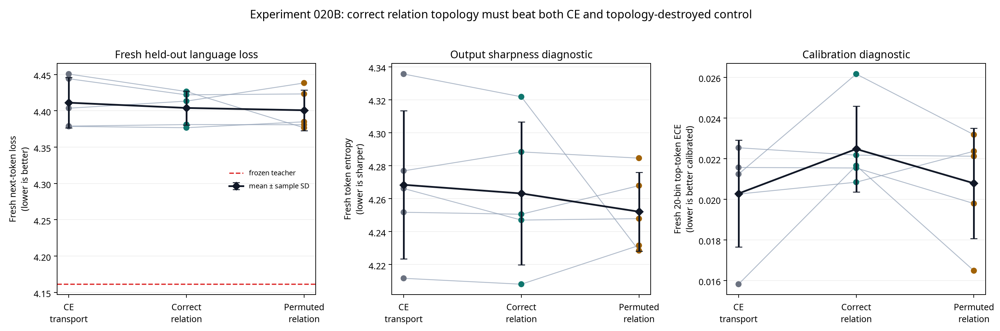

# Experiment 020B Report: Relational Geometry at the Deployed Two-Layer Interface

**Author:** Manus AI

**Status:** Complete preregistered five-seed endpoint study.

**Decision:** **Negative for the post-block relational-geometry transfer hypothesis.** Correctly indexed teacher token-relation geometry did not beat either matched CE transport or the equal-compute topology-destroyed relation control at the fresh endpoint. Third-layer replacement, 1B/7B scaling, and quantization remain **denied**.

## Executive Finding

Experiment 020B tested whether a frozen teacher’s correctly indexed post-block token-relation topology could improve a fully deployed two-layer Transformer–Mamba hybrid beyond ordinary conditional CE transport and an equal-compute relation target whose teacher token-position topology was destroyed by a fixed cyclic column shift.

The primary result is negative. Correct relational geometry had mean fresh loss **4.4039 ± 0.0234**, modestly lower than CE transport at **4.4111 ± 0.0347**, but the paired advantage was only **0.0072 ± 0.0151 nats/token** and occurred in **3/5** seeds. The required result was at least **4/5** wins and a mean advantage of at least **0.0300**. More decisively, the correctly indexed condition did not beat the permuted equal-compute control: its mean disadvantage was **−0.0032 ± 0.0280 nats/token**, again with only **3/5** wins.

> **Conclusion:** The measured post-block token-relation loss was successfully reduced on development data, but correct teacher token-relation correspondence was not causally useful at the fresh endpoint. The topology-destroyed control was at least as competitive. This rules out the stated relational-correspondence mechanism under the locked two-layer, rank-16, 720-update protocol.

## Hypothesis and Locked Comparison

The source checkpoint was `HuggingFaceTB/SmolLM-135M`. Fresh Mamba mixers replaced attention in layers 0 and 1, with state sizes 64 and 96. Each was followed by the rank-16, conditional residual transport map from Experiment 018. The source embeddings, norms, MLPs, output head, unwrapped attention, and teacher remained frozen. Only the fresh Mamba mixers and transport maps trained.

For frozen-teacher and hybrid residual sequences captured at the input to decoder layer 2, the relational target represented each token’s row-wise distribution of normalized token-to-token similarities. The correct condition minimized the KL divergence to this correctly indexed teacher relation matrix. The topology control used exactly the same values, coefficient, dimensions, computation, and row normalization but cyclically shifted target columns by half the nonterminal sequence length, breaking their correspondence to hybrid token positions.

| Condition | Objective | Intended causal role |
|---|---|---|
| **A — Conditional CE transport** | \(CE\) | Measures ordinary end-to-end Mamba transport adaptation. |
| **B — Correct relational geometry** | \(CE+0.20L_{rel}\) | Tests whether correct teacher relation topology is useful. |
| **C — Permuted relational control** | \(CE+0.20L_{perm}\) | Controls equal teacher-value exposure and auxiliary compute while destroying topology. |

The relation coefficient 0.20 was selected before this protocol by the completed, test-free Experiment 020A development-only pilot. Each Experiment 020B condition received identical paired initialization, architecture, parameter count, alpha schedule, AdamW settings, calibration order, 720 updates, and prompts. The immutable protocol is [`EXPERIMENT_020B_RELATIONAL_GEOMETRY_ENDPOINT_PROTOCOL.md`](EXPERIMENT_020B_RELATIONAL_GEOMETRY_ENDPOINT_PROTOCOL.md).

## Fresh Held-Out Primary Endpoint

The final evaluation used a new WikiText-2 raw test range: eligible sequences 513–640. This follows distinct ranges used by Experiments 014–019. In every seed, the test split was requested only after all three conditions had completed all updates.

Positive advantages favor the correctly indexed relation condition.

| Seed | Frozen teacher | A: CE | B: Correct relation | C: Permuted relation | A − B | C − B |
|---:|---:|---:|---:|---:|---:|---:|
| 20260891 | 4.1613 | 4.4035 | 4.4133 | 4.4383 | −0.0097 | 0.0250 |
| 20260892 | 4.1613 | 4.4441 | 4.4219 | 4.4232 | 0.0221 | 0.0012 |
| 20260893 | 4.1613 | 4.4506 | 4.4265 | 4.3765 | 0.0241 | −0.0499 |
| 20260894 | 4.1613 | 4.3789 | 4.3810 | 4.3808 | −0.0021 | −0.0002 |
| 20260895 | 4.1613 | 4.3785 | 4.3767 | 4.3848 | 0.0018 | 0.0081 |
| **Mean ± sample SD** | **4.1613 ± 0.0000** | **4.4111 ± 0.0347** | **4.4039 ± 0.0234** | **4.4007 ± 0.0281** | **0.0072 ± 0.0151** | **−0.0032 ± 0.0280** |

The correct relation condition was directionally lower loss than CE in seeds 92, 93, and 95, but worse in seeds 91 and 94. The permuted control was lower loss than correct relation in seed 93 by 0.0499 nats/token and had a slightly lower aggregate mean loss. These are incompatible with a claim that the correct token-position topology carried a reliable causal advantage.

## Integrity, Calibration, and Scale Checks

All mechanical integrity safeguards passed. At alpha zero, every branch reproduced frozen-teacher fresh loss exactly in all seeds; the maximum deviation was 0.0. All 15 final endpoints had both gates at alpha one and finite loss, and every seed respected the post-training final-slice load rule. Fixed greedy continuations were coherent in all five seeds, but they were a sanity check rather than a ranking criterion.

| Prespecified requirement | Observed result | Assessment |
|---|---:|---|
| Alpha-zero exactness, alpha-one endpoint, and final-slice isolation | 5/5; maximum loss deviation 0.0 | **Pass** |
| Finite fresh losses | 15/15 endpoints | **Pass** |
| B wins versus A | 3/5; mean \(A-B=0.0072\) | **Fail** |
| Mean \(A-B\) at least 0.03 | 0.0072 | **Fail** |
| B wins versus C | 3/5; mean \(C-B=-0.0032\) | **Fail** |
| Mean \(C-B\) at least 0.03 | −0.0032 | **Fail** |
| B fresh ECE increase versus A no more than 0.01 | maximum increase 0.0058 | **Pass** |
| B within 0.15 loss of frozen teacher | maximum loss gap 0.2652 | **Fail** |
| Third layer / scaling / quantization authorization | All prior checks required | **Denied** |

The confidence diagnostics do not rescue the mechanism. Correct relation had acceptable calibration under the predeclared ECE bound, but calibration is not the primary endpoint. Similarly, coherent generations do not demonstrate transfer because every branch retains the same frozen pretrained source backbone.

## Development Diagnostic Dissociation

The relational objective accomplished its local aim: correct-relation KL fell from **0.0271 ± 0.0016** under CE transport to **0.0221 ± 0.0015** under correct relational training. Yet the topology-destroyed control attained an even lower correct-relation diagnostic, **0.0211 ± 0.0012**, and a marginally better mean fresh loss. Thus, this study reproduces the project’s central warning: improving a carefully chosen local diagnostic does not by itself yield a globally compatible residual-stream intervention.

| Condition | Development correct-relation KL | Development CE | Post-layer-1 drift | Post-layer-2 drift |
|---|---:|---:|---:|---:|
| A — CE transport | 0.0271 ± 0.0016 | 3.6797 ± 0.0370 | 0.4922 ± 0.0335 | 0.4846 ± 0.0200 |
| B — Correct relation | 0.0221 ± 0.0015 | 3.6922 ± 0.0393 | 0.4871 ± 0.0358 | 0.4853 ± 0.0216 |
| C — Permuted relation | 0.0211 ± 0.0012 | 3.6765 ± 0.0814 | 0.4690 ± 0.0288 | 0.4804 ± 0.0165 |

The result is especially informative because the control did not merely remove a teacher loss; it retained the same relation distribution values and coefficient while destroying the intended sequence-position topology. That control’s comparable or better endpoint makes the narrow correct-topology interpretation untenable in this setup.

## Recommendation

Do **not** scale or tune this mechanism against the completed fresh slice. The correct next scientific status is a negative result for post-block relational geometry as implemented here. Any future hypothesis must be structurally different, preregistered before implementation, and tested with an equal-capacity/equal-budget CE control plus an appropriately targeted causal control. It must begin on the small model with a new untouched final partition.

This result does not prove cross-architecture transfer impossible. It shows that, after values, directions, moments, downstream anchors, output sharpening, and now post-block relation topology have all failed their paired fresh-endpoint thresholds, there is still no demonstrated teacher-specific mechanism that justifies third-layer replacement or model-scale escalation.

## Rationale Sources

The source notes used relational KD only as a hypothesis-generation basis, not as evidence that the present objective should work. They cite relation-based geometry transfer [1] [2] and heterogeneous-architecture alignment concerns [3] [4]. The current fresh-endpoint result overrides any analogy from those other settings.

## References

[1] [Park et al. *Relational Knowledge Distillation.* CVPR 2019.](https://arxiv.org/abs/1904.05068)

[2] [Kim et al. *Relational Representation Distillation.* 2024.](https://arxiv.org/html/2407.12073v3)

[3] [Liu et al. *Cross-Architecture Knowledge Distillation.* ACCV 2022.](https://openaccess.thecvf.com/content/ACCV2022/html/Liu_Cross-Architecture_Knowledge_Distillation_ACCV_2022_paper.html)

[4] [Hao et al. *One-for-All: Bridge the Gap Between Heterogeneous Architectures in Knowledge Distillation.* NeurIPS 2023.](https://neurips.cc/virtual/2023/poster/72626)
