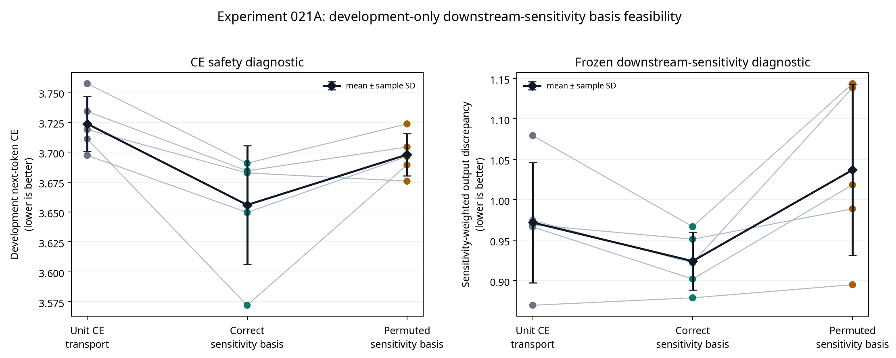

# Experiment 021A Report: Development-Only Downstream-Sensitivity Basis Pilot

**Author:** Manus AI

**Status:** Complete five-seed development-only pilot. The WikiText-2 test split was not requested, loaded, tokenized, inspected, or scored.

**Decision:** The pilot passed its locked feasibility rule. A separate endpoint protocol may test the **unchanged** downstream-sensitivity basis against equal-budget unit and topology-destroyed controls. This is **not** fresh-test evidence of knowledge transfer, a successful conversion, or scaling readiness.

## Purpose

Experiments 014, 017, 019, and 020B established that improving a teacher-derived activation, moment, output, entropy, relation, or downstream diagnostic does not by itself improve the fully deployed hybrid’s fresh language-model endpoint. Experiment 021A therefore moved the teacher signal out of the optimizer objective entirely.

The pilot estimated, once before branch training, the frozen teacher’s diagonal downstream sensitivity for each residual-stream coordinate: the mean squared gradient of the teacher next-token CE with respect to the frozen attention output. This estimate formed a fixed, bounded, mean-one gain for the rank-16 conditional transport correction. Every trainable branch then optimized ordinary next-token CE only.

The question was deliberately limited:

> Can the correctly ordered sensitivity basis create a CE-safe development signal that differs from the same gain spectrum with residual-coordinate correspondence destroyed?

## Locked Design

The source was `HuggingFaceTB/SmolLM-135M`, with fresh Mamba mixers replacing attention layers 0 and 1 at state sizes 64 and 96. The transport correction was rank 16 and exactly zero-initialized. The source backbone, teacher, embeddings, norms, MLPs, output head, and unwrapped attention layers stayed frozen. Both gates reached alpha one after sequential 300- and 420-update stages; branches trained only with CE.

For teacher attention output \(a_\ell\) and teacher CE \(\ell_{CE}\), the pre-training sensitivity statistic was

> \(f_{\ell,j}=\operatorname{mean}_{x,t}[(\partial\ell_{CE}/\partial a_{\ell,t,j})^2]\).

The fixed gain was the mean-one renormalized, bounded square root of relative sensitivity, clipped to [0.50, 2.00]. The transport became \(m+q\odot\mathrm{correction}\). The permuted control cyclically shifted the **same** gain values by half the hidden width, preserving gain spectrum, rank, parameter count, initialization, optimizer, CE objective, schedule, data, and compute while breaking correspondence to the residual coordinates that generated the sensitivity statistic.

| Condition | Fixed transport-correction gain | Teacher-derived optimizer term | Causal role |
|---|---|---|---|
| A — Unit conditional CE transport | Unit vector | None | CE-only architecture baseline. |
| B — Correct sensitivity basis | Correctly ordered sensitivity gain | None | Tests downstream-sensitivity-informed capacity allocation. |
| C — Permuted sensitivity basis | Same gain values, cyclically shifted | None | Equal-spectrum topology-destroyed control. |

The pilot used seeds 20260901–20260905, 1,024 eligible training sequences for CE calibration, and validation eligible sequences 65–128 for diagnostics. The locked protocol is [`EXPERIMENT_021A_DOWNSTREAM_SENSITIVITY_BASIS_PILOT_PROTOCOL.md`](EXPERIMENT_021A_DOWNSTREAM_SENSITIVITY_BASIS_PILOT_PROTOCOL.md).

## Data Isolation and Integrity

Every seed explicitly records `test_split_requested: false`. All 15 condition-seed endpoints were finite, both active gates ended at alpha one, and alpha-zero reconstruction reproduced the frozen teacher development loss exactly. The largest alpha-zero development-loss deviation was 0.0.

| Safeguard | Result | Assessment |
|---|---:|---|
| Test split requested | 0/5 seeds | **Pass** |
| Alpha-zero loss deviation | maximum 0.0; threshold \(10^{-5}\) | **Pass** |
| Alpha-one two-layer endpoints | 15/15 | **Pass** |
| Finite endpoint diagnostics | 15/15 | **Pass** |

## Locked Feasibility Results

Positive CE differences mean worse development CE than unit-basis CE transport. Negative sensitivity-weighted differences mean lower transport-versus-attention discrepancy in the frozen teacher’s downstream-sensitive residual directions.

| Development comparison | Mean difference ± sample SD | Locked requirement | Assessment |
|---|---:|---|---|
| Correct basis B − unit A development CE | −0.06782 ± 0.04011 | No more than +0.020 | **Pass** |
| Correct basis B − unit A weighted discrepancy | −0.04763 ± 0.04926 | Lower than zero | **Pass** |
| Correct basis B − permuted C weighted discrepancy | −0.11272 ± 0.07961 | Lower than zero | **Pass** |

| Condition | Development CE | Sensitivity-weighted discrepancy | Unweighted attention-output MSE | Post-layer-2 drift |
|---|---:|---:|---:|---:|
| A — Unit CE transport | 3.72366 ± 0.02298 | 0.97160 ± 0.07425 | 1.04348 ± 0.06994 | 0.50461 ± 0.01341 |
| B — Correct sensitivity basis | 3.65584 ± 0.04950 | 0.92397 ± 0.03571 | 0.97178 ± 0.03916 | 0.50620 ± 0.00401 |
| C — Permuted sensitivity basis | 3.69786 ± 0.01780 | 1.03669 ± 0.10546 | 1.10017 ± 0.11022 | 0.51192 ± 0.01974 |

The correct basis passed every predeclared feasibility condition. It was CE-safe on average and showed lower sensitivity-weighted discrepancy than both unit and permuted bases. The pilot therefore permits a separately preregistered endpoint test with the formula fixed exactly as written.

> **Interpretation boundary:** A development-only gain effect is not a language-model transfer result. It may still represent ordinary optimization reparameterization, a development-split idiosyncrasy, or a mechanism that does not generalize. The correct basis must beat both the unit and equal-spectrum permuted controls on a new fresh endpoint before it can be described as teacher-specific transfer.

## What Is Permitted Next

A subsequent endpoint study must retain the same source, two active layers, Mamba state sizes, rank, sensitivity-sequence count, gain formula, clipping bounds, cyclic shift, update count, optimizer, alpha schedule, and CE-only training objective. It must use new paired seeds and a new untouched final test range. Correct basis B must beat both A and C in at least 4/5 seeds with mean paired advantages of at least 0.03 nats/token, while retaining alpha-zero integrity, alpha-one completion, finite losses, calibration safety, and the teacher-gap criterion.

No third replacement layer, 1B/7B scaling, 4-bit quantization, or standalone-Mamba claim is authorized by this pilot.

## Rationale Sources

The pilot takes sensitivity as a hypothesis generator, not a result guarantee. Jacobian matching literature identifies output sensitivity as a distinct transfer object from activation matching [1]. Cross-architecture work cautions against direct feature mimicry and motivates testing correspondence through targeted controls [2]. The detailed rationale and limitations are recorded in [`E021_DOWNSTREAM_SENSITIVITY_BASIS_SOURCE_NOTES.md`](E021_DOWNSTREAM_SENSITIVITY_BASIS_SOURCE_NOTES.md).

## References

[1] [Srinivas, S., and Fleuret, F. “Knowledge Transfer with Jacobian Matching.” ICML 2018.](https://proceedings.mlr.press/v80/srinivas18a.html)

[2] [Liu, Y. et al. “Cross-Architecture Knowledge Distillation.” ACCV 2022.](https://openaccess.thecvf.com/content/ACCV2022/html/Liu_Cross-Architecture_Knowledge_Distillation_ACCV_2022_paper.html)
