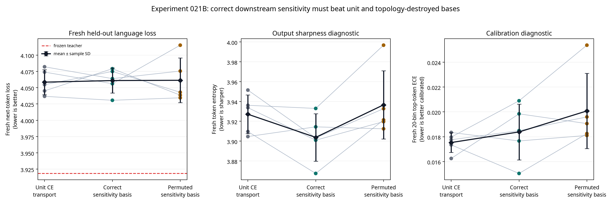

# Experiment 021B Report: Downstream-Sensitivity Basis at the Two-Layer Endpoint

**Author:** Manus AI

**Status:** Complete five-seed preregistered endpoint study.

**Decision:** **Negative for the downstream-sensitivity-basis transfer hypothesis.** The correctly ordered frozen sensitivity basis did not beat either unit conditional CE transport or the equal-spectrum, topology-destroyed basis at the fresh endpoint. Third-layer replacement, 1B/7B scaling, and quantization remain **denied**.

## Executive Finding

Experiment 021B tested a structural use of frozen teacher information rather than a teacher-derived training loss. Before branch training, the frozen teacher estimated the mean squared next-token-CE gradient with respect to each source-attention output coordinate. This derived a fixed, bounded, mean-one gain for the rank-16 conditional transport correction. All branches then optimized only ordinary next-token CE. The central causal control preserved every gain value and every training detail but cyclically permuted gain locations across residual-stream coordinates.

The fresh endpoint rejected the mechanism. Correct sensitivity basis B had mean fresh loss **4.0609 ± 0.0192**, compared with **4.0584 ± 0.0191** for unit conditional CE transport A. The paired mean advantage \(A-B\) was **−0.0024 ± 0.0236 nats/token**, and B won only **3/5** seeds. Against the equal-spectrum permuted basis C, B had mean advantage \(C-B\) of only **0.0004 ± 0.0397** with **3/5** wins. Both effects miss the predeclared 4/5 and 0.0300 requirements.

> **Conclusion:** The correct residual-coordinate ordering of the frozen downstream-sensitivity estimate did not provide a reliable causal fresh-loss benefit. A development improvement in sensitivity-weighted discrepancy cannot be interpreted as transferred knowledge without the missing endpoint advantage over both controls.

## Hypothesis and Locked Conditions

The source checkpoint was `HuggingFaceTB/SmolLM-135M`. Attention layers 0 and 1 were sequentially replaced by fresh Mamba mixers with state sizes 64 and 96. The source checkpoint remained frozen apart from the fresh Mamba modules and their rank-16 conditional residual transports. Each transport uses a zero-initialized output correction, guaranteeing exact source behavior at alpha zero:

> \(y=(1-\alpha)A(h)+\alpha\{m+q\odot W_{up}\operatorname{SiLU}(W_{down}[\operatorname{RMS}(h);\operatorname{RMS}(m);\operatorname{RMS}(h)-\operatorname{RMS}(m)])\}.\)

For teacher attention output \(a_\ell\) and teacher CE \(\ell_{CE}\), the fixed basis was

> \(f_{\ell,j}=\operatorname{mean}_{x,t}[(\partial\ell_{CE}/\partial a_{\ell,t,j})^2]\),

> \(q_{\ell,j}=\operatorname{RenormMean1}[\operatorname{clip}(\sqrt{f_{\ell,j}/(\operatorname{mean}(f_\ell)+10^{-12})},0.50,2.00)].\)

The teacher supplied no optimizer target, auxiliary loss, or inference input. All three branches trained with the same CE-only objective, 1,024 calibration sequences, 720 updates, alpha schedule, rank, parameter count, initialization within paired seed, and frozen backbone.

| Condition | Fixed correction basis | Teacher-derived optimizer signal | Causal role |
|---|---|---|---|
| A — Unit conditional CE transport | Unit gain | None | CE-only architecture baseline. |
| B — Correct sensitivity basis | Correctly ordered fixed gain | None | Tests sensitivity-informed residual capacity allocation. |
| C — Permuted sensitivity basis | Same gain values, cyclically shifted | None | Equal-spectrum control that destroys coordinate correspondence. |

The immutable endpoint protocol is [`EXPERIMENT_021B_DOWNSTREAM_SENSITIVITY_BASIS_ENDPOINT_PROTOCOL.md`](EXPERIMENT_021B_DOWNSTREAM_SENSITIVITY_BASIS_ENDPOINT_PROTOCOL.md).

## Fresh Held-Out Primary Endpoint

The final evaluation used a new WikiText-2 raw test range, eligible sequences 641–768. This follows non-overlapping test ranges used by Experiments 014–020B. The test split was loaded only after all three conditions completed their full 720-update training budget in every seed.

Positive advantages favor the correctly ordered basis B.

| Seed | Frozen teacher | A: Unit CE | B: Correct basis | C: Permuted basis | A − B | C − B |
|---:|---:|---:|---:|---:|---:|---:|
| 20260911 | 3.9184 | 4.0820 | 4.0638 | 4.0755 | 0.0182 | 0.0116 |
| 20260912 | 3.9184 | 4.0546 | 4.0749 | 4.0429 | −0.0203 | −0.0320 |
| 20260913 | 3.9184 | 4.0739 | 4.0560 | 4.1151 | 0.0178 | 0.0591 |
| 20260914 | 3.9184 | 4.0451 | 4.0790 | 4.0385 | −0.0340 | −0.0405 |
| 20260915 | 3.9184 | 4.0367 | 4.0306 | 4.0344 | 0.0061 | 0.0038 |
| **Mean ± sample SD** | **3.9184 ± 0.0000** | **4.0584 ± 0.0191** | **4.0609 ± 0.0192** | **4.0613 ± 0.0342** | **−0.0024 ± 0.0236** | **0.0004 ± 0.0397** |

The small aggregate differences are neither stable nor large enough for the research claim. B beat A only in seeds 11, 13, and 15. B beat C only in seeds 11, 13, and 15. The fact that a cyclic permutation of the same sensitivity-gain spectrum remained statistically and practically comparable prevents an interpretation that the correct residual-coordinate ordering transferred a useful teacher-specific structural prior.

## Integrity, Fresh-Slice Isolation, and Scaling Criteria

All mechanical safeguards passed. At alpha zero, every branch reproduced the frozen teacher fresh loss exactly; the maximum deviation was 0.0. All 15 endpoints reached alpha one with finite fresh losses. Each result recorded that the fresh test data loaded after all three conditions completed training.

A serialization defect was detected only during post-run aggregation: the endpoint script wrote a literal `\\n` suffix after each otherwise complete JSON document. The stored numerical content was not changed and no seed, optimizer update, or evaluation was rerun. The suffix was deterministically removed from all five files, the serializer was corrected to emit a real newline, and every result was validated with the JSON parser before aggregation. This was a post-execution artifact repair, not a protocol or data change.

| Prespecified requirement | Observed result | Assessment |
|---|---:|---|
| Alpha-zero exactness, alpha-one completion, and final-slice isolation | 5/5; maximum loss deviation 0.0 | **Pass** |
| Finite fresh losses | 15/15 endpoints | **Pass** |
| B wins versus A | 3/5; mean \(A-B=-0.0024\) | **Fail** |
| Mean \(A-B\) at least 0.03 | −0.0024 | **Fail** |
| B wins versus C | 3/5; mean \(C-B=0.0004\) | **Fail** |
| Mean \(C-B\) at least 0.03 | 0.0004 | **Fail** |
| B ECE increase over A no more than 0.01 | maximum 0.0036 | **Pass** |
| B within 0.15 loss of teacher | maximum gap 0.1606 | **Fail** |
| Third layer / scaling / quantization authorization | All prior requirements | **Denied** |

Fixed greedy continuations were coherent in all seeds and conditions. They do not rank branches and do not demonstrate knowledge transfer, because the frozen pretrained source backbone remains shared across all hybrids.

## Development-to-Endpoint Dissociation

The mechanism again shows the project’s central dissociation. On development diagnostics, correct basis B had lower mean sensitivity-weighted discrepancy (**0.9812**) than unit A (**0.9989**) and permuted C (**1.0288**). It also had lower unweighted output MSE than both controls. Yet the fresh endpoint found no reliable B advantage over either control.

| Condition | Development CE | Weighted discrepancy | Unweighted MSE | Post-layer-2 drift |
|---|---:|---:|---:|---:|
| A — Unit CE transport | 3.6630 ± 0.0307 | 0.9989 ± 0.0559 | 1.0732 ± 0.0630 | 0.4961 ± 0.0055 |
| B — Correct sensitivity basis | 3.6734 ± 0.0491 | 0.9812 ± 0.0883 | 1.0285 ± 0.0753 | 0.5142 ± 0.0242 |
| C — Permuted sensitivity basis | 3.6619 ± 0.0475 | 1.0288 ± 0.0669 | 1.1010 ± 0.0714 | 0.4950 ± 0.0101 |

The sensitivity statistic is more globally motivated than direct value or relation matching, but the result shows that diagonal downstream sensitivity alone is still insufficient to characterize a globally compatible two-layer residual-stream intervention. This is a negative result for the fixed diagonal-basis mechanism, not a proof that all Jacobian- or sensitivity-based transfer is impossible.

## Recommendation

Do **not** scale, quantize, or tune this mechanism against the completed fresh range. The correct scientific conclusion is that the diagonal downstream-sensitivity basis did not establish a teacher-specific endpoint benefit under the frozen two-layer, rank-16, CE-only protocol.

The cumulative research boundary is now stronger: direct static mapping, local value/direction/moment targets, downstream anchor loss, output sharpening, relational topology, and diagonal frozen sensitivity allocation have all failed matched fresh-endpoint criteria. The next candidate, if any, must be architecturally distinct from another diagonal or local-proxy correction and preregistered before implementation with a new untouched final slice and matched causal control.

## Rationale Sources

Sensitivity-based transfer was used only to generate this falsifiable hypothesis. Jacobian matching distinguishes response sensitivity from activation matching [1], while cross-architecture distillation cautions against treating heterogeneous representations as directly interchangeable [2]. The present endpoint result governs this setting.

## References

[1] [Srinivas, S., and Fleuret, F. “Knowledge Transfer with Jacobian Matching.” ICML 2018.](https://proceedings.mlr.press/v80/srinivas18a.html)

[2] [Liu, Y. et al. “Cross-Architecture Knowledge Distillation.” ACCV 2022.](https://openaccess.thecvf.com/content/ACCV2022/html/Liu_Cross-Architecture_Knowledge_Distillation_ACCV_2022_paper.html)
